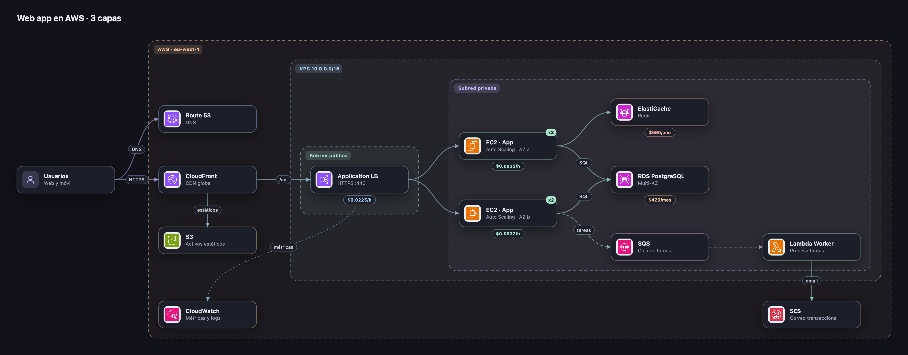

<div align="center">

[English](README.md) · **Español**


# Diagramon

**Diagramas de arquitectura cloud animados, que viven 100 % en tu computadora.**

Sin servidor. Sin cuenta. Sin internet. Sin enviar ni un byte de los datos de tus clientes.




</div>

---

## 🔒 Tus datos no salen de tu equipo

Diagramon nació para dibujar arquitecturas **reales**, con nombres de clientes, IPs, cuentas y costos
de verdad. Ese tipo de información no debería viajar a un servicio de terceros solo para hacer un dibujo.

| | Diagramon | Herramientas de diagramas en la nube |
|---|---|---|
| ¿Dónde vive tu diagrama? | En tu navegador y en los archivos que tú exportas | En los servidores del proveedor |
| ¿Necesita cuenta? | No | Normalmente sí |
| ¿Necesita internet? | No, ni para los iconos | Sí |
| ¿Hay analítica o telemetría? | No, cero | A menudo |
| ¿Usa IA en la nube para "texto a diagrama"? | No: el lenguaje de texto se procesa en local | A veces |

**Cómo lo garantiza**

- **Es un solo HTML con JavaScript propio.** Sin librerías externas, sin CDN, sin fuentes web cargadas de internet, sin trackers.
  Los iconos oficiales van incrustados en los archivos `assets/icons/*.js` y las tres tipografías en `assets/fonts/fonts.js` (base64).
- **El navegador bloquea la red.** `index.html` declara una política de seguridad
  (`Content-Security-Policy: connect-src 'none'`). Aunque alguien añadiera código que intente enviar datos,
  el navegador lo rechaza.
- **El código es abierto y corto.** Puedes leer cada línea y comprobarlo tú mismo: no hay ninguna llamada a `fetch`,
  `XMLHttpRequest`, `WebSocket` ni `sendBeacon`.
- **El guardado automático es local.** Se usa el `localStorage` de tu navegador, en tu equipo.
  Las exportaciones (SVG, PNG, JSON) son archivos que solo tú decides dónde guardar.

> **Consejos para datos sensibles:** en un equipo compartido, usa una ventana privada o borra los datos del sitio al terminar.
> Revisa también las extensiones del navegador: tienen acceso a las páginas que abres, incluida esta.
>
> **Importa solo archivos de confianza.** Trata los JSON o archivos de infraestructura como código de origen desconocido como cualquier archivo descargado.

---

## ✨ Qué puedes hacer

- 🎞️ **Diagramas vivos**: partículas que recorren las conexiones, trazos que fluyen y un botón **Flujo** que reproduce el recorrido paso a paso.
- ☁️ **Iconos oficiales** de **AWS, Azure, Google Cloud, SAP BTP y Microsoft Fabric** (unos 290 servicios), además de iconos genéricos.
- 🏗️ **Importar infraestructura como código**: Terraform (estado, plan o `.tfstate`), CloudFormation/SAM, Kubernetes y Docker Compose, procesados en local.
- 🧩 **Grupos anidados**: región › VPC › subred, clúster › namespace…
- 🖱️ **Selección múltiple, alineación y guías**: alinea, reparte con el mismo espacio y pega nodos a bordes y centros.
- 💵 **Costos a mano**: precio en USD por hora, mes, año o varios años, en un recuadro bajo cada servicio y con el total mensual.
- 🏷️ **Clasificación de datos y cifrado en tránsito**: marca nodos y conexiones como *Público, Interno, Confidencial, PII, PCI* o *PHI*, indica si cada conexión va cifrada 🔒 o no, y recibe un aviso en rojo cuando datos sensibles viajan sin cifrar.
- ⌨️ **Diagrama como código**: escribe en texto y el lienzo se actualiza al momento. Texto, JSON y lienzo siempre sincronizados.
- 🗂️ **Versiones y ambientes**: guarda el lienzo como *Versión 1, 2, 3…* o como *Desarrollo, Calidad, Producción*, ábrelos cuando quieras y compáralos con el lienzo: lo nuevo en verde, lo cambiado en amarillo y lo eliminado como fantasma rojo.
- ⚑ **Observaciones de revisión**: levanta a mano una observación en cualquier componente, con qué hay que corregir, quién la levantó, cuándo y la fecha compromiso. Las etiquetas muestran *EN REVISIÓN*, *VENCIDA* o *RESUELTA*, y las abiertas salen listadas en la exportación.
- 🧭 **Gobierno de datos**: tablas en cada conexión con su **linaje** de origen a consumo, **dueño, responsable del dato, equipo y centro de costo** por componente (heredados del grupo) con una vista **Gobierno**, **región y jurisdicción** con aviso cuando datos sensibles salen de ella (*Datos PII salen de la UE → EE. UU.*), y capas **bronce / plata / oro** del data lake con estilo y leyenda propios.
- 📐 **Conectores en ángulo recto**: cambia entre curvas y líneas en ángulo recto que esquivan los nodos, para todo el diagrama o para una sola conexión.
- 🧾 **Leyenda y cajetín** en las exportaciones SVG y PNG: estilos de conexión, colores de los componentes, clasificaciones de datos, autor, versión, fecha y costo estimado. Listo para entregar.
- 🔦 **Resaltar el flujo** de un componente: vecinos, destinos, orígenes o todo.
- 🌐 **Inglés o español**: la app abre en inglés; el botón 🌐 de la barra superior (o la tecla **`L`**) la pasa a español y recuerda tu elección.
- 🌗 **Modo oscuro** por defecto, modos **claro** y **negro de alto contraste** con una tecla, y dos paletas (Pastel y Neón).
- 📤 **Exporta** a SVG (animado), PNG o JSON. **Importa** un JSON arrastrándolo al lienzo.
- ↩️ **Deshacer y rehacer**, guardado automático y orden automático del diagrama.

<div align="center">

</div>

---

## 🚀 Empezar en 30 segundos

**¿Solo quieres probarlo?** Abre la [demo en línea](https://dataengileb.github.io/diagramon/). Es la misma página, servida por GitHub Pages: tu diagrama se queda en tu navegador.

1. **Descarga** el proyecto: botón verde **Code › Download ZIP**, o con git:

   ```bash
   git clone https://github.com/dataengileb/diagramon.git
   ```

2. **Abre** `index.html` con doble clic en cualquier navegador moderno.
3. Listo. No hay paso 3. 🎉

---

## 📚 Documentación

| Guía | Qué encontrarás |
|---|---|
| [📘 Tutorial](docs/guide.es.md) | Paso a paso: tu primer diagrama, conexiones, grupos, costos, disponibilidad, clasificación de datos, gobierno, revisión de seguridad, cumplimiento, STRIDE, versiones, notas y zonas, presentar, exportar, vistas, niveles C4 y los [atajos de teclado](docs/guide.es.md#atajos-de-teclado) |
| [🏗️ Importar infraestructura como código](docs/iac-import.es.md) | De Terraform, CloudFormation/SAM, Kubernetes y Docker Compose a un diagrama, con los archivos de ejemplo |
| [🔐 Compartir un diagrama cifrado](docs/sharing.es.md) | Un único HTML protegido con contraseña que se abre en cualquier sitio |
| [⌨️ Diagrama como código](docs/text-format.es.md) | La sintaxis de la pestaña *Texto*, en inglés y en español |
| [🎨 Personalizar](docs/customize.es.md) | Temas, paletas, tipos, reglas y plantillas en `src/config.js` |
| [🗂️ Estructura del proyecto](docs/project-structure.es.md) | Qué hace cada archivo y carpeta |
| [🧭 Pendientes conocidos](docs/known-gaps.es.md) | Lo que falta probar fuera del navegador, mejoras pequeñas pendientes y límites por diseño |
| [🛣️ Ideas y posibles mejoras](docs/roadmap.es.md) | Cambios grandes abiertos a colaboradores, como las conexiones entre grupos |

---

## 🤝 Contribuir

¡Las contribuciones son bienvenidas! Abre un *issue* con tu idea o envía un *pull request*.

Para mantener el espíritu del proyecto:

- **Sin dependencias externas** ni pasos de compilación: tiene que seguir funcionando con doble clic.
- **Sin conexiones de red**: nada de analítica, CDN, fuentes web cargadas de internet ni APIs (las tipografías van incluidas).
- Lo personalizable va en `src/config.js`.

Más detalles en [CONTRIBUTING.md](CONTRIBUTING.md) (en inglés). Para reportar una vulnerabilidad de forma privada, consulta [SECURITY.md](SECURITY.md).

---

## 🙏 Créditos

Diagramon está inspirado en [**archify**](https://github.com/tt-a1i/archify) de [@tt-a1i](https://github.com/tt-a1i),
una skill para agentes que convierte ideas, planes o código en diagramas interactivos (licencia MIT).
Gracias por la inspiración. 💜

---

## 📄 Licencia

El código de Diagramon es **open source** bajo la [licencia MIT](LICENSE): úsalo, modifícalo y compártelo libremente,
también en proyectos comerciales.

Las tipografías incluidas son [Inter](https://github.com/rsms/inter), [IBM Plex Sans](https://github.com/IBM/plex) y [Fira Code](https://github.com/tonsky/FiraCode), con la licencia SIL Open Font License 1.1
(copias en [`assets/fonts/OFL-Inter.txt`](assets/fonts/OFL-Inter.txt), [`assets/fonts/OFL-IBMPlexSans.txt`](assets/fonts/OFL-IBMPlexSans.txt) y [`assets/fonts/OFL-FiraCode.txt`](assets/fonts/OFL-FiraCode.txt)).

Los **iconos oficiales** de `assets/icons/` pertenecen a Amazon Web Services, Microsoft, Google y SAP, y **no** están cubiertos por la licencia MIT.
AWS, Microsoft y Google permiten usarlos en diagramas de arquitectura según sus propias condiciones.
Los iconos de SAP BTP vienen de [SAP/btp-solution-diagrams](https://github.com/SAP/btp-solution-diagrams)
bajo la licencia Apache 2.0 (copia en [`assets/icons/LICENSE-SAP.txt`](assets/icons/LICENSE-SAP.txt)).
Los iconos de Microsoft Fabric vienen del paquete oficial `@fabric-msft/svg-icons` de Microsoft, con licencia MIT
(copia en [`assets/icons/LICENSE-FABRIC.txt`](assets/icons/LICENSE-FABRIC.txt)), y siguen las mismas reglas de uso que los de Azure.
SAP solo publica iconos para sus servicios BTP. Sus aplicaciones de negocio (S/4HANA, ECC, TM, EWM…) no tienen icono oficial,
así que Diagramon las muestra con el logotipo de SAP.
Los **logotipos** de Azure, Google Cloud y SAP que se ofrecen como icono de grupo (una suscripción de Azure, un proyecto de Google Cloud, una cuenta de SAP BTP)
son marcas de sus dueños y solo identifican el servicio. Origen y condiciones en [`assets/icons/LICENSE-LOGOS.txt`](assets/icons/LICENSE-LOGOS.txt).
Diagramon los muestra sin cambios: no los recortes, gires ni deformes, y no los uses para representar un producto propio.
AWS, Azure, Microsoft Fabric, Google Cloud y SAP son marcas de sus respectivos dueños. Diagramon no está afiliado a ninguno de ellos.

<div align="center">
<sub>Hecho con 💜 y colores pastel. Tus diagramas, en tu equipo.</sub>
</div>
