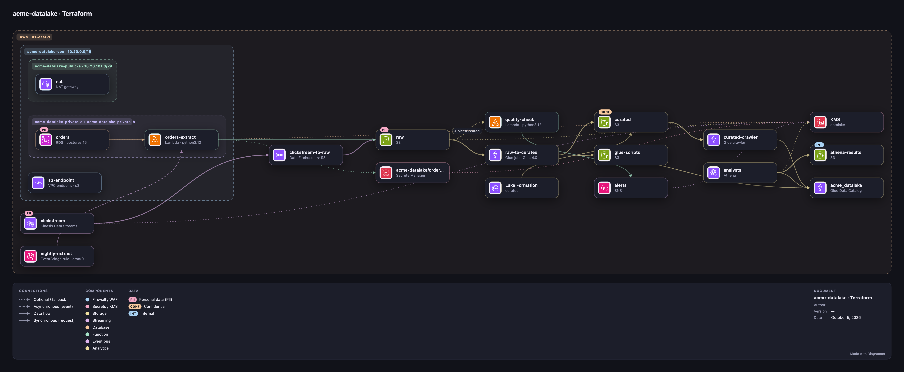

<div align="center">

[English](README.md) · **Español**


# Diagramon

**Diagramas de arquitectura cloud animados, que viven 100 % en tu computadora.**

Sin servidor. Sin cuenta. Sin internet. Sin enviar ni un byte de los datos de tus clientes.


</div>

---

## 🔒 Tus datos no salen de tu equipo

Diagramon nació para dibujar arquitecturas **reales**, con nombres de clientes, IPs, cuentas y costos
de verdad. Ese tipo de información no debería viajar a un servicio de terceros solo para hacer un dibujo.

| | Diagramon | Herramientas de diagramas en la nube |
|---|---|---|
| ¿Dónde vive tu diagrama? | En tu navegador y en los archivos que tú exportas | En los servidores del proveedor |
| ¿Necesita cuenta? | No | Normalmente sí |
| ¿Necesita internet? | No, ni para los iconos | Sí |
| ¿Hay analítica o telemetría? | No, cero | A menudo |
| ¿Usa IA en la nube para "texto a diagrama"? | No: el lenguaje de texto se procesa en local | A veces |

**Cómo lo garantiza**

- **Es un solo HTML con JavaScript propio.** Sin librerías externas, sin CDN, sin fuentes web cargadas de internet, sin trackers.
  Los iconos oficiales van incrustados en los archivos `icons/*.js` y las tres tipografías en `fonts/fonts.js` (base64).
- **El navegador bloquea la red.** `index.html` declara una política de seguridad
  (`Content-Security-Policy: connect-src 'none'`). Aunque alguien añadiera código que intente enviar datos,
  el navegador lo rechaza.
- **El código es abierto y corto.** Puedes leer cada línea y comprobarlo tú mismo: no hay ninguna llamada a `fetch`,
  `XMLHttpRequest`, `WebSocket` ni `sendBeacon`.
- **El guardado automático es local.** Se usa el `localStorage` de tu navegador, en tu equipo.
  Las exportaciones (SVG, PNG, JSON) son archivos que solo tú decides dónde guardar.

> **Consejos para datos sensibles:** en un equipo compartido, usa una ventana privada o borra los datos del sitio al terminar.
> Revisa también las extensiones del navegador: tienen acceso a las páginas que abres, incluida esta.

---

## ✨ Qué puedes hacer

- 🎞️ **Diagramas vivos**: partículas que recorren las conexiones, trazos que fluyen y un botón **Flujo** que reproduce el recorrido paso a paso.
- ☁️ **Iconos oficiales** de **AWS, Azure, Google Cloud, SAP BTP y Microsoft Fabric** (unos 290 servicios), además de iconos genéricos.
- 🏗️ **Importar infraestructura como código**: Terraform (estado, plan o `.tfstate`), CloudFormation/SAM, Kubernetes y Docker Compose, procesados en local.
- 🧩 **Grupos anidados**: región › VPC › subred, clúster › namespace…
- 🖱️ **Selección múltiple, alineación y guías**: alinea, reparte con el mismo espacio y pega nodos a bordes y centros.
- 💵 **Costos a mano**: precio en USD por hora, mes, año o varios años, en un recuadro bajo cada servicio y con el total mensual.
- 🏷️ **Clasificación de datos y cifrado en tránsito**: marca nodos y conexiones como *Público, Interno, Confidencial, PII, PCI* o *PHI*, indica si cada conexión va cifrada 🔒 o no, y recibe un aviso en rojo cuando datos sensibles viajan sin cifrar.
- ⌨️ **Diagrama como código**: escribe en texto y el lienzo se actualiza al momento. Texto, JSON y lienzo siempre sincronizados.
- 🗂️ **Versiones y ambientes**: guarda el lienzo como *Versión 1, 2, 3…* o como *Desarrollo, Calidad, Producción*, ábrelos cuando quieras y compáralos con el lienzo: lo nuevo en verde, lo cambiado en amarillo y lo eliminado como fantasma rojo.
- ⚑ **Observaciones de revisión**: levanta a mano una observación en cualquier componente, con qué hay que corregir, quién la levantó, cuándo y la fecha compromiso. Las etiquetas muestran *EN REVISIÓN*, *VENCIDA* o *RESUELTA*, y las abiertas salen listadas en la exportación.
- 🧭 **Gobierno de datos**: tablas en cada conexión con su **linaje** de origen a consumo, **dueño, responsable del dato, equipo y centro de costo** por componente (heredados del grupo) con una vista **Gobierno**, **región y jurisdicción** con aviso cuando datos sensibles salen de ella (*Datos PII salen de la UE → EE. UU.*), y capas **bronce / plata / oro** del data lake con estilo y leyenda propios.
- 📐 **Conectores en ángulo recto**: cambia entre curvas y líneas en ángulo recto que esquivan los nodos, para todo el diagrama o para una sola conexión.
- 🧾 **Leyenda y cajetín** en las exportaciones SVG y PNG: estilos de conexión, colores de los componentes, clasificaciones de datos, autor, versión, fecha y costo estimado. Listo para entregar.
- 🔦 **Resaltar el flujo** de un componente: vecinos, destinos, orígenes o todo.
- 🌐 **Inglés o español**: la app abre en inglés; el botón 🌐 de la barra superior (o la tecla **`L`**) la pasa a español y recuerda tu elección.
- 🌗 **Modo oscuro** por defecto, modos **claro** y **negro de alto contraste** con una tecla, y dos paletas (Pastel y Neón).
- 📤 **Exporta** a SVG (animado), PNG o JSON. **Importa** un JSON arrastrándolo al lienzo.
- ↩️ **Deshacer y rehacer**, guardado automático y orden automático del diagrama.

<div align="center">

</div>

---

## 🚀 Empezar en 30 segundos

**¿Solo quieres probarlo?** Abre la [demo en línea](https://dataengileb.github.io/diagramon/). Es la misma página, servida por GitHub Pages: tu diagrama se queda en tu navegador.

1. **Descarga** el proyecto: botón verde **Code › Download ZIP**, o con git:

   ```bash
   git clone https://github.com/dataengileb/diagramon.git
   ```

2. **Abre** `index.html` con doble clic en cualquier navegador moderno.
3. Listo. No hay paso 3. 🎉

---

## 📘 Tutorial

### 1. Tu primer diagrama

1. Abre la pestaña **Plantillas** y elige *Web app en AWS · 3 capas* para ver un ejemplo completo.
2. Pulsa **Nuevo** para empezar con el lienzo vacío.
3. En **Componentes**, abre la lista **Proveedor** y elige **Genéricos**, **AWS**, **Azure**, **Google Cloud**, **SAP BTP** o **Microsoft Fabric**.
   Solo verás los componentes de ese proveedor. Usa el buscador: `lambda`, `s3`, `hana`…
   También entiende sinónimos y equivalentes, en español e inglés: `sql` encuentra RDS, Cloud SQL y Azure SQL; `k8s` encuentra EKS, AKS y GKE; `cola` encuentra SQS y Service Bus.
   En **SAP**, arriba salen los **sistemas de negocio SAP** (S/4HANA, ECC, TM, EWM…) con el logotipo de SAP.
4. Haz **clic** en un componente para añadirlo al centro, o **arrástralo** al lienzo.
   Doble clic en un hueco del lienzo añade otro igual al último.

### 2. Conectar

- Selecciona un nodo y pulsa **`C`**, luego haz clic en el destino.
- O selecciona un nodo y haz **`⇧` + clic** en el destino.
- Haz clic en una conexión para cambiar su etiqueta y su estilo:
  **síncrona** (petición), **asíncrona** (evento), **flujo de datos** u **opcional**.

### 3. Editar y agrupar

- Haz **clic** en un nodo: el panel derecho muestra nombre, detalle, icono, color y descripción.
- Para cambiar el icono, escribe parte de su nombre en el buscador **Icono** (`lamb`, `sql`, `kafka`…) y elige una sugerencia con el ratón o con ↑ ↓ y Enter. La × vuelve al icono genérico.
- **Doble clic** sobre un nodo, grupo o conexión lo renombra.
- En **Grupo › + Nuevo grupo…** creas un grupo. Arrastra su etiqueta para mover el grupo entero.

### 4. Varios a la vez y alineación

- **`⌘` + clic** (o **`Ctrl` + clic**) añade o quita nodos de la selección.
- **`⇧` + arrastrar** en el fondo selecciona un área. **`⌘A`** selecciona todo.
- Con varios elegidos, el panel derecho los **alinea** (izquierda, centro, derecha, arriba, medio, abajo)
  y los **reparte** con el mismo espacio en horizontal o vertical.
- Al arrastrar aparecen **guías** rosas que pegan el nodo a los bordes y centros de los demás. **`Alt`** las desactiva.

### 5. Costos

1. Selecciona un servicio.
2. En **Costo (USD)** escribe el precio.
3. Elige el periodo: **Por hora**, **Mensual**, **Anual** o **Multianual** (con número de años).

El precio aparece en un recuadro bajo el servicio. Arriba del lienzo ves el **total aproximado al mes**.
Con varios servicios elegidos, el panel muestra el costo de la selección.

> Diagramon no consulta precios en internet (por privacidad). Los costos los escribes tú.

#### Desglose y escenarios

Abre **Costos…** desde el menú *Exportar*, o con el botón **Costos** de la pastilla de la vista **Costo** (tecla `7`).

- Pestaña **Desglose**: agrupa el costo mensual por **Equipo**, **Centro de costo**, **Dueño**, **Grupo** (de primer nivel), **Tipo**, **Proveedor**, **Región** o **Capa**. Cada fila muestra los componentes, el costo mensual y anual (mensual × 12) y su parte del total con una barra. Los componentes sin valor van a **Sin asignar**. Un clic en una fila filtra el lienzo por ella (no disponible para *Tipo*).
- Pestaña **Comparar escenarios**: elige **A** y **B** entre el lienzo y cada versión guardada. Se usan las fotos de las versiones tal como se guardaron; el lienzo no se toca. Verás los totales, el cambio (importe y %), por mes y por año, una tabla por componente (nuevo en verde, cambiado en amarillo, eliminado en rojo; un clic en el encabezado ordena, *Solo cambios* oculta los que no cambian) y el cambio por equipo, centro de costo, dueño…
- **Actual vs propuesto**: guarda como versión la arquitectura de hoy (p. ej. *Aprobada*), convierte el lienzo en la propuesta y abre el diálogo: A es la última versión aprobada y B el lienzo. **Guardar el lienzo como escenario propuesto** guarda una versión llamada *Propuesto* y la elige como B. En la pestaña **Versiones**, **Comparar costos** en cualquier versión abre el diálogo con esa versión como A y el lienzo como B.
- **CSV** exporta la tabla que se ve (`<diagrama>-costs.csv` o `<diagrama>-cost-compare.csv`).
- La leyenda de la vista Costo lista los 5 equipos que más cuestan, el panel de un grupo muestra su total mensual, al comparar una versión en el lienzo se añade una línea *Costo: $A → $B*, y el informe de arquitectura suma *Costo por equipo* y *Costo por centro de costo*.
- Desde la consola: `Diagramon.costBreakdown(by)` devuelve `[{ key, label, monthly, nodes }]`; `Diagramon.compareCosts(idVersionA, idVersionB)` (`null` = lienzo) devuelve `{ a: { label, monthly }, b: { label, monthly }, delta, deltaPct, rows: [{ id, label, a, b, delta, status }] }`; `Diagramon.openCosts('breakdown' | 'compare')` abre el diálogo.

### 6. Clasificación de datos y cifrado

1. Selecciona un componente. En **Clasificación de datos**, pulsa las etiquetas de los datos que guarda o maneja: **PUB**, **INT**, **CONF**, **PII**, **PCI**, **PHI**. Puedes elegir varias.
2. Selecciona una conexión. En **Cifrado en tránsito** elige **Cifrado** o **Sin cifrar**, y marca los **Datos en tránsito**.

Las etiquetas salen arriba de cada nodo y en la etiqueta de la conexión, junto a un candado: cerrado 🔒 si va cifrada, abierto si no.
Si una conexión *Sin cifrar* lleva datos sensibles, o une un componente con datos sensibles, se pone roja y aparece un aviso arriba del lienzo.
Con varios componentes elegidos, las etiquetas se aplican a todos.

#### Linaje de datos

Marca qué tablas o conjuntos de datos viajan por cada conexión y sigue uno desde su origen hasta donde se consume.

1. Selecciona una conexión. En **Conjuntos de datos** escribe el nombre de una tabla y pulsa `Intro` o `,` para añadirla (el campo sugiere los nombres que ya usa el diagrama). La **×** de cada ficha la quita.
2. Pulsa una ficha (o la tecla `D` y elige de la lista, o una fila de la leyenda **Conjuntos de datos** de la ficha del documento) para ver su linaje: se resalta todo el recorrido y cada componente lleva un número (su profundidad). Los orígenes salen en verde y los consumos en naranja.
3. La barra sobre el lienzo lo resume (*orígenes → consumos · saltos*). `Esc` lo quita.

Al seleccionar un componente se listan los conjuntos de sus conexiones. En la vista **Datos** los nombres se dibujan bajo la etiqueta de cada conexión y salen en las exportaciones. Las conexiones con flecha en los dos extremos cuentan en ambos sentidos.

#### Residencia de datos

1. Selecciona un componente o un grupo y escribe su **Región** (una región cloud como `eu-west-1`, `westeurope`, `europe-west1`, o un código de país como `ES`, `US`). El campo sugiere las regiones que ya usa el diagrama. Los componentes heredan la región del grupo más cercano que la tenga; un grupo con la región en el nombre (`Región eu-west-1 (Irlanda)`) se detecta solo, y el panel dice *heredada de…* o *deducida de…*.
2. Diagramon asigna a cada región una jurisdicción (UE, Reino Unido, EE. UU., Canadá, Brasil, Latinoamérica, Asia-Pacífico, Medio Oriente, África) y la muestra junto al campo. Las regiones desconocidas se ignoran.
3. Si una conexión une dos regiones de jurisdicciones distintas y lleva datos sensibles (sus propias clases o, si no tiene, las de su origen), el inspector muestra `eu-west-1 (UE) → us-east-1 (EE. UU.)` y un aviso en rojo como *Datos PII salen de la UE → EE. UU.*. Si la transferencia está cubierta (cláusulas tipo, decisión de adecuación…), activa **Transferencia autorizada**: sigue listada pero deja de avisar.

Las vistas **Seguridad** y **Física** muestran la región en cada componente. En **Seguridad**, las transferencias no autorizadas son críticas (rojo, con un globo) y sus extremos se resaltan; la leyenda añade *Datos sensibles fuera de su jurisdicción* y el resumen sobre el lienzo las cuenta. El filtro tiene la ficha **Fuera de su jurisdicción** (en *Datos*) y una sección **Región** (una ficha por jurisdicción y *Región desconocida*). Desde la consola: `Diagramon.crossBorder()`.

#### Capas del data lake

Indica en qué capa de un data lake tipo medallón está cada componente.

1. Selecciona un componente o un grupo. En **Capa del data lake** elige **Bronce**, **Plata** u **Oro** (o *Ninguna*).
2. Los componentes heredan la capa de su grupo, así que basta con marcar la zona una vez. El botón *Ninguna* pasa a decir *Heredada (Oro)* y una nota indica de qué grupo viene.
3. Bajo los botones puedes cambiar los nombres de todo el documento entre **Bronce · Plata · Oro** y **Crudo · Curado · Consumo** (raw / curated / serving). Se aplica a etiquetas, leyenda y filtros.

Un componente con capa lleva una franja de color en su borde izquierdo y una etiqueta pequeña en la esquina inferior izquierda. Un grupo con capa propia tiene el borde más grueso y teñido, y una etiqueta junto al título.
La leyenda **Capas** (exportaciones y ficha del documento, tecla **I**) lista las capas en uso; en la ficha del documento, una fila filtra por esa capa. El menú **Filtrar** tiene una sección *Capa* y la vista **Datos** resalta los componentes con capa.
Las vistas *Contexto* y *Costo* ocultan las capas. Desde la consola: `Diagramon.layers()` y `Diagramon.setLayerNames('zones')`.

### 7. Observaciones de revisión

1. Selecciona un componente y pulsa **⚑ Levantar una observación**.
2. Escribe la **Observación** (qué hay que corregir), **Levantada por**, la **Fecha de levantamiento** (hoy por defecto) y la **Fecha compromiso**.
3. Cuando esté corregida, pulsa **✓ Marcar resuelta**. **Reabrir** la vuelve a abrir; **Quitar** la borra.

El componente lleva una etiqueta: **EN REVISIÓN** (naranja), **VENCIDA** (roja, si pasó la fecha compromiso) o **RESUELTA** (verde).
El panel dice cuántos días faltan o cuántos lleva vencida, y el resumen sobre el lienzo cuenta las abiertas y las vencidas.
Diagramon recuerda el último nombre de revisor. Las exportaciones con leyenda listan las observaciones abiertas con su fecha compromiso.

#### Revisión de seguridad automática

Diagramon revisa el diagrama en busca de problemas de seguridad habituales y **solo avisa, nunca bloquea nada**. La pestaña **Revisión** (junto a *Versiones*) lista todos los hallazgos, agrupados por fuente y gravedad; su etiqueta muestra cuántos hay abiertos con el color del peor. El mismo número aparece en la línea sobre el lienzo (*⚑ N hallazgos*) y, en la vista **Seguridad**, cada componente con hallazgos lleva una pastilla *⚠ n*.

| Regla | Gravedad | Salta cuando |
|---|---|---|
| Datos sensibles sin cifrar | crítica | Una conexión marcada *Sin cifrar* lleva PII, PCI, PHI o datos confidenciales |
| Cifrado sin indicar | media | Una conexión lleva datos sensibles pero no se indica si va cifrada |
| Público con datos sensibles | alta | Un componente público guarda datos sensibles |
| Almacén sin respaldo | media | Una base de datos o almacenamiento no tiene componente ni conexión de respaldo |
| Transferencia entre fronteras sin autorizar | alta | Datos sensibles cruzan jurisdicciones sin transferencia autorizada |
| Datos sensibles sin dueño | baja | Un componente con datos sensibles no tiene dueño ni responsable |
| Almacén público | alta | Un almacén de datos es público o lo alcanzan directamente usuarios o un servicio externo |

- **La exposición y el respaldo se deducen.** Un componente es *público* si está en un área pública (un grupo con el icono de subred pública de AWS, o llamado *pública*, *DMZ*, *internet*…) o si recibe una conexión de usuarios, una app web o móvil o un servicio externo. Un almacén *tiene respaldo* si está conectado a un componente de respaldo (AWS Backup, Recovery Services, un nombre con *backup*, *respaldo*, *snapshot*, *réplica*…) o por una conexión llamada *backup*, *snapshot*, *réplica*… En el panel del componente, **Seguridad** muestra el valor deducido y por qué; elige **Pública / Interna** o **Sí / No** para anularlo.
- **Descartar** un hallazgo lo oculta: Diagramon pide un motivo breve y lo guarda (con el autor y la fecha) en el diagrama. **Ver descartados (N)** los lista con su motivo y un botón **Restaurar**.
- **Levantar como observación de revisión** convierte el hallazgo en una observación de revisión manual del componente (ver arriba), con el hallazgo como texto.
- Pulsa el objetivo de un hallazgo para seleccionarlo y acercarte a él. Tus observaciones de revisión aparecen en la misma lista (no se descartan: se resuelven en el panel del componente).
- **Exportar CSV** guarda todos los hallazgos, también los descartados, para una hoja de cálculo.
- Desde la consola: `Diagramon.findings({ dismissed: false })`, `Diagramon.dismissFinding(id, motivo)` y `Diagramon.restoreFinding(id)`.

#### Mapeo de cumplimiento

Marca qué controles cumple cada componente (ISO 27001, SOC 2, GDPR, HIPAA, PCI DSS) y exporta una matriz componente × control.

1. Selecciona un componente o un grupo y abre la sección **Cumplimiento** del panel (se abre sola cuando hay algún control).
2. Escribe en **Añadir control** para buscar en el catálogo (`iso27001:A.8.24 — Uso de criptografía`) y elige uno. Se añade como **Brecha**: nada cuenta como cumplido hasta que lo confirmes.
3. Pon cada control en **Cumple**, **Parcial**, **Brecha** o **N/A**. La **×** lo quita.
4. Los componentes **heredan** los controles de sus grupos: marca `pcidss:1.3` una vez en el grupo *Pagos* y todo lo que contiene lo recibe. Elegir un estado en un componente sustituye al heredado (la **×** vuelve entonces al valor heredado).
5. Las fichas **Sugeridos** proponen controles según las clases de datos del componente (PII → GDPR Art. 32, 5, 25…; PCI → PCI DSS 3.5, 4.2…; PHI → seguridad en la transmisión de HIPAA…) y para componentes en una conexión entre jurisdicciones (GDPR Art. 44–46). Pulsa una para añadirla como brecha.
6. Con varios componentes seleccionados, la misma sección se aplica a todos.

**Matriz de cumplimiento** (botón de la sección, o **Exportar › Matriz de cumplimiento**): una fila por componente con controles o datos sensibles, una columna por control en uso agrupada por marco, con ✓ cumple, ◐ parcial, ✗ brecha, — N/A y vacío si no está mapeado. La cabecera se queda a la vista al desplazarte; una fila inferior muestra la cobertura de cada control (cumple ÷ componentes que no son N/A) y las tarjetas de arriba resumen cada marco. Elige un marco para acotarla. **CSV** exporta una fila por componente y una columna por control (`met|partial|gap|na|`); **CSV (largo)** una fila por componente × control con marco, control, título, grupo, estado, heredado de y clases de datos (`<diagrama>-compliance.csv`, `<diagrama>-compliance-long.csv`).

Los hallazgos de revisión incluyen un grupo **Cumplimiento**: una brecha es *media* (*alta* para un control de PCI DSS en un componente con datos PCI, o de HIPAA con PHI), un control parcial es *baja*, y un componente con PII, PCI o PHI al que le falta su control principal sugerido (por ejemplo GDPR Art. 32) es *baja*, solo para los marcos que el diagrama ya usa, así que un diagrama sin controles no genera avisos. El **Filtro** tiene una sección **Cumplimiento** (una ficha por marco en uso, más *Con brechas*). Desde la consola: `Diagramon.compliance()` y `Diagramon.exportCompliance('wide' | 'long')`.
El catálogo está en `config.js` › `compliance` y es un subconjunto práctico, no las normas completas; los títulos de los controles son paráfrasis cortas. Es una ayuda de documentación, no una auditoría ni una certificación.

#### Dueños y responsables

Indica quién responde por cada componente.

1. Selecciona un componente (o un grupo) y abre la sección **Responsables** del panel (se abre sola cuando ya tiene algún valor).
2. Rellena **Dueño**, **Responsable de datos**, **Equipo** y **Centro de costo**. Cada campo sugiere los valores ya usados en el diagrama para que los nombres coincidan.
3. Los componentes **heredan** cada campo del grupo más cercano que lo tenga: pon el equipo una vez en el grupo y todo lo de dentro lo recibe. Un valor heredado aparece en gris con *heredado de <grupo>*; si escribes uno propio, lo sustituye.
4. Con varios componentes seleccionados, los cuatro campos se aplican a todos (*Varios* cuando difieren; vaciar un campo lo borra en todos).

La descripción emergente de un componente muestra dueño, responsable, equipo y centro de costo. El panel **Filtrar** añade fichas de **Equipo**, **Dueño**, **Responsable** y **Centro de costo** (y *Sin asignar* para dueño y equipo). La ficha del documento (**`I`**) lista los **Equipos** con sus dueños y cuántos componentes tienen; al pulsar uno se filtra por él.
La tecla **`8`** abre la vista **Gobierno**: cada componente toma el color de su equipo (o de su dueño si no tiene equipo), lleva debajo una etiqueta con el equipo, y la leyenda y las exportaciones listan todos los equipos. Desde la consola: `Diagramon.owners()` devuelve `[{ team, owners, stewards, nodes }]`.

### Filtros

**Filtrar** (o **`G`**) abre un panel de fichas: **Datos** (cada clase del diagrama, más *Flujos sensibles sin cifrar*), **Revisión**, **Proveedor**, **Categoría**, **Grupo**, **Costo** y, cuando el diagrama los usa, **Equipo**, **Dueño**, **Responsable**, **Centro de costo**, **Región** y **Capa**.
Las fichas de una misma sección suman (O); las secciones distintas se combinan (Y). Lo que no coincide se atenúa, incluidos los grupos vacíos y las conexiones cuyos extremos no coinciden ambos; seleccionar un componente sigue funcionando encima.
Una etiqueta sobre el lienzo muestra el filtro activo (`Filtro: PII · AWS · 7 de 20`) con una **×** para quitarlo. Se recuerda por navegador y nunca altera las exportaciones. Desde la consola: `Diagramon.setFilter({ data: ['pii'], provider: ['aws'] })` y `Diagramon.clearFilter()`.

### 8. Versiones y ambientes

Abre la pestaña **Versiones**.

- **+ Versión N** guarda una foto fija del lienzo. Sirve como historial: *Versión 1*, *Versión 2*…
- **DEV**, **QA** y **PROD** guardan el lienzo como ese ambiente. Cada ambiente tiene una sola copia; al guardar otra vez se actualiza.
- Antes de guardar puedes escribir una **nota**, por ejemplo *antes de la migración*.
- **Abrir** lo carga en el lienzo. Una etiqueta sobre el título muestra qué está abierto y avisa si hay cambios sin guardar.
- **Comparar** marca las diferencias con el lienzo: **verde** es nuevo, **amarillo** cambiado y los fantasmas **rojos punteados** se eliminaron.
  La tarjeta lista cada diferencia; haz clic en una para ir a ella. **Esc** o **Parar** terminan la comparación.
- Cada tarjeta muestra su **estado**: **Borrador**, **En revisión**, **Aprobado** o **Rechazado**, que también aparece sobre el título y en el cajetín exportado.
- **Nombre de la versión**: en **✎** puedes ponerle a una versión o ambiente un nombre opcional como `1.2`, `2026-T4` o `MVP`. Si parece un número se muestra como *Versión 1.2*, si no tal cual, y un ambiente como *Producción · 1.2*. También alimenta el cajetín.
- **✎** edita el estado, el **autor de la arquitectura**, las fechas de **creación** y **actualización** y la nota, sin tener que borrar y volver a guardar. El último autor que escribiste se propone en las versiones nuevas.
- Sobre la lista, las **fichas de estado** (*Todos*, *Borrador*, *En revisión*…) con su cuenta filtran versiones y ambientes; vuelve a pulsar la activa para verlo todo.
- Al actualizar un ambiente **Aprobado** o **Rechazado**, vuelve a **En revisión**, porque su contenido cambió.
- Actualizar o eliminar una versión o ambiente **Aprobado** pide confirmación antes. Aprobar uno que aún tiene **observaciones de revisión abiertas** en su foto avisa, las lista y conserva el estado anterior si cancelas. Una tarjeta aprobada con observaciones abiertas muestra una marca coral **⚑ observaciones abiertas**.
- Aprobar o rechazar registra **quién decidió y cuándo** (se ve en la tarjeta y en el cajetín exportado). Un rechazo pide un **motivo**, y cada cambio de estado queda en un **historial de estados** que se lee en el formulario de edición.
- Guardar, abrir, eliminar y cada edición se deshacen con **`⌘Z`**.
- Las versiones se guardan dentro del diagrama, así que **Exportar › JSON** las lleva todas.

#### Decisiones de arquitectura (ADR)

Abre la pestaña **ADR** para registrar *por qué* la arquitectura es como es, al estilo MADR: **contexto**, **decisión** y **consecuencias**.

- **+ Nueva decisión** agrega una ficha (`ADR-001`, `ADR-002`…). Haz clic para editar su título, **estado** (*Propuesta*, *Aceptada*, *Rechazada*, *Obsoleta*, *Reemplazada*), fecha, decisores y los tres textos. Elegir **Reemplazada por** la marca como *Reemplazada*.
- Vincula la decisión a lo que afecta: **Vincular selección** enlaza los componentes, la conexión o el grupo seleccionados, y **Vincular versión…** una versión guardada. Lo vinculado aparece como fichas; haz clic en una para seleccionarla en el lienzo (o ir a la versión).
- Los paneles de componente, conexión y grupo tienen un campo **Decisiones** con los ADR vinculados, **+ Nueva decisión** (ya vinculada) y **Vincular…** para elegir una existente. Cada tarjeta de versión lista sus ADR y tiene **+ ADR**.
- Los componentes con una decisión *propuesta* o *aceptada* muestran una etiqueta **ADR n** en el lienzo (en las vistas que muestran las marcas de revisión); pasa el cursor para leer los títulos.
- Fichas de estado con su conteo y un buscador filtran la lista. **Exportar Markdown** descarga todas las decisiones en un solo `.md`: una tabla índice y una sección por ADR.
- Una decisión *propuesta* desde hace más de 30 días es un hallazgo bajo en la pestaña **Revisión**.
- Las decisiones son del documento, no de una versión: abrir una versión o editar la pestaña *Texto* no las toca, y se guardan en **Exportar › JSON** bajo `decisions`. Todo se puede deshacer con **`⌘Z`**.
- Desde la consola: `Diagramon.decisions()`, `Diagramon.addDecision({ title, status, context, decision, consequences, links: { nodes: [...] } })`, `Diagramon.updateDecision(id, cambios)`, `Diagramon.removeDecision(id)` y `Diagramon.exportDecisions()`.

### 9. Notas adhesivas y zonas de riesgo

Usa los dos botones junto al zoom (abajo a la derecha del lienzo).
- **Añadir una nota adhesiva** pone una nota en el centro de la vista. Haz doble clic (o usa el panel) para escribir.
- **Añadir una zona de riesgo** dibuja un área rayada y con borde discontinuo bajo los grupos, con una etiqueta como `⚠ ALTA · Subred pública expuesta`. Elige su **Severidad** (*Baja, Media, Alta, Crítica*) y una descripción opcional en el panel.
- Selecciona varios componentes y pulsa **⚠ Marcar como zona de riesgo** para dibujar una zona alrededor.
- Arrastra para mover, arrastra el tirador de la esquina para cambiar el tamaño (se ajusta a la cuadrícula), **`⌘D`** duplica y **Supr** elimina. Todo se puede deshacer.
- El resumen sobre el lienzo cuenta las zonas (*⚠ 2 zonas de riesgo (1 crítica)*), las exportaciones con leyenda las listan por severidad, y las versiones y el JSON conservan notas y zonas.

#### Modelado de amenazas (STRIDE)

Algunas zonas son **fronteras de confianza** en vez de zonas de riesgo: abre una zona y cambia **Tipo** a *Frontera de confianza* (o selecciona componentes y pulsa **Frontera de confianza**, junto a *Marcar como zona de riesgo*). Una frontera tiene nombre, un **Nivel de confianza** opcional (*Internet, DMZ, Interna, Restringida*…) y una descripción. Se dibuja con una línea discontinua gruesa, sin rayado, y una etiqueta como `FRONTERA DE CONFIANZA · DMZ` con un escudo; la leyenda y la ficha del documento listan las fronteras aparte de las zonas de riesgo.
- Un componente está dentro de una frontera cuando su centro cae dentro de la zona. Las zonas pueden anidarse o solaparse. Una conexión **cruza** una frontera cuando sus dos extremos no están en el mismo conjunto de fronteras.
- Selecciona una conexión que cruza: la sección **Amenazas (STRIDE)** muestra *Cruza: ‹Internet› → ‹DMZ›* y una sugerencia por categoría (**S**uplantación, manipulación (**T**ampering), **R**epudio, divulgación de **I**nformación, **D**enegación de servicio, **E**levación de privilegios) con una severidad según reglas sencillas (cifrado, datos sensibles, dirección entrante, destino que es un almacén de datos o de identidad).
- Decide cada una: **Abierta · Mitigada · Aceptada · No aplica**, con una nota (qué hiciste o por qué). Solo se guardan las decisiones y todo se puede deshacer. Las amenazas abiertas aparecen como hallazgos en *Amenazas STRIDE*.
- En la vista **Seguridad** las conexiones que cruzan llevan una pastilla `STRIDE n` (n = amenazas abiertas). **Exportar › Modelo de amenazas (CSV)** escribe una fila por conexión que cruza y categoría (`<diagrama>-stride.csv`).
- Desde la consola: `Diagramon.threats()` devuelve `[{ edge, from, to, zones, category, severity, status, note }]` y `Diagramon.exportThreats()` descarga el CSV.

### 10. Presentar y exportar

- **Flujo** (o **`P`**) ilumina el diagrama paso a paso, de los clientes a los datos.
- **Presentar** (o **`V`**) pasa a pantalla completa sin paneles: una vista general con el título, una diapositiva por grupo (en orden de lectura, acercando y atenuando el resto) y una vista general final. Sin grupos, recorre el flujo. **`→`**, **`Espacio`** o clic avanzan, **`←`** retrocede, **`Inicio`/`Fin`** y las teclas numéricas saltan, **`P`** reproduce el flujo y **`Esc`** sale y restaura tu vista. La edición se desactiva mientras presentas.
- **Ordenar** recoloca todo automáticamente, siguiendo el flujo. Cada grupo se ordena dentro de su propia caja, así los grupos nunca se pisan. **Ajustar** (o **`F`**) centra el diagrama.
- **Ángulos** (o **`E`**) cambia las conexiones entre curvas y líneas en ángulo recto que esquivan los nodos. Varias líneas en el mismo lado de un nodo salen de puntos separados y repartidos, para que no se solapen.
  Para cambiar una sola conexión, selecciónala y elige su **Línea**.
- **Exportar** › SVG, PNG o JSON. Guarda el JSON para volver a abrirlo más tarde con **Importar**.
- **Exportar › Mermaid, PlantUML o draw.io** convierte el diagrama en código o en un archivo para otras herramientas: un flowchart de Mermaid (se ve en GitHub, GitLab y Notion), un diagrama de PlantUML sin inclusiones externas, o un `.drawio` que conserva la misma disposición, los grupos anidados y los iconos oficiales.
- **Exportar › HTML cifrado** crea un único `.html` para compartir un diagrama en privado. Quien lo recibe le da doble clic, escribe la contraseña y ve el diagrama (oscuro o claro, con zoom). Sin la app, sin instalar ni descargar nada. Detalles más abajo.
- El menú **Exportar** también tiene **Leyenda y cajetín** (activado por defecto), con los campos **Autor** y **Versión**.
  Los archivos SVG y PNG llevan entonces un panel abajo con solo lo que usa el diagrama (estilos de conexión, candados,
  colores de los componentes, clasificaciones de datos) y un cajetín con título, autor, versión, fecha y costo estimado.

#### Informe de arquitectura

**Exportar › Informe de arquitectura…** genera el documento que piden los comités de arquitectura, sin bibliotecas y sin red:

- **Formato**: **PDF** (abre el diálogo de impresión del navegador con un documento A4 listo para imprimir: elige *Guardar como PDF*), **Markdown** (`.md`) o **HTML** (`.html`, un único archivo autocontenido, el mismo documento que el PDF y sin peticiones externas).
- **Secciones** (todas activas por defecto, se recuerdan): Resumen · Diagrama · Componentes · Conexiones · Clasificación y residencia de datos · Dueños · Capas del data lake · Costos · Hallazgos de seguridad · Cumplimiento · Modelo de amenazas · Decisiones (ADR) · Historial de versiones · Notas y zonas de riesgo. Una sección sin datos se omite y aparece como *(ninguno)*.
- **Diagrama**: elige cuáles de las 8 vistas incluir (la activa, más Seguridad y Datos cuando aportan algo). Si el diagrama tiene diagramas internos (niveles C4), **Incluir diagramas internos** dibuja cada uno. Las imágenes usan el tema claro por defecto (ideal para imprimir); **Usar el tema actual** mantiene el de la pantalla.
- **Imágenes en Markdown**: van incrustadas como PNG `data:`. Algunos visores de Markdown las bloquean, así que marca **Guardar las imágenes como archivos aparte** para descargar los PNG junto al `.md` y referenciarlos por nombre.
- Los textos salen en el idioma actual de la interfaz, con fechas y dinero en sus formatos, y todo va escapado.
- Desde la consola: `Diagramon.exportReport({ format: 'pdf' | 'md' | 'html', sections?: [...], views?: [...], scopes?: true | false, theme?: 'light' | 'current', separateImages?: boolean })` devuelve una promesa con el HTML o Markdown generado tras iniciar la descarga o el diálogo de impresión. Claves de sección: `summary diagram components connections data owners layers costs findings compliance threats decisions versions notes`.

### Vistas

Una **vista** es una forma de mirar el mismo diagrama: solo decide qué se ve, con cuánto detalle y qué destaca. Nunca cambia tus componentes ni posiciones. Elígela en el selector **Vista** de la barra superior, con las teclas **`1`**–**`8`**, o desde la consola (`Diagramon.setView('security')`). Cuando la vista no es *Completa*, una pastilla sobre el lienzo la nombra, cuenta lo que oculta o atenúa y tiene una **×** para volver. La ficha del documento y la leyenda de las exportaciones siguen la vista activa.

| Tecla | Vista | Qué ves |
|---|---|---|
| `1` | **Completa** | Todo: componentes, grupos, etiquetas, marcas, costos, zonas y notas |
| `2` | **Contexto** | Grupos de primer nivel como cajas cerradas con flujos combinados entre ellas (solo lectura; doble clic en una caja la abre en Completa) |
| `3` | **Lógica** | Servicios y flujos sin los grupos físicos (VPC, subredes, regiones, cuentas…) |
| `4` | **Física** | Dónde corre cada cosa: todos los grupos y zonas de riesgo, sin etiquetas de conexión |
| `5` | **Seguridad** | Datos sensibles y cifrado en tránsito resaltados (sin cifrar, o sin indicar, con datos sensibles); el resto se atenúa |
| `6` | **Datos** | Almacenes y flujos de datos, coloreados por su clasificación más sensible |
| `7` | **Costo** | Costo mensual como mapa de calor, con el total |
| `8` | **Gobierno** | Quién es dueño de qué: componentes coloreados por equipo (o dueño), con una etiqueta de equipo bajo cada uno; los que no tienen ninguno se atenúan |

Las reglas de cada vista están en `config.js` › `views`; en el inspector puedes marcar un grupo como `lógico` o `físico`.

### Niveles C4 (drill-down)

Un mismo archivo puede tener varios niveles de detalle, como en el **modelo C4**: *contexto del sistema* → *contenedores* → *componentes*. Cualquier componente puede tener un **diagrama interno**; el modelo sigue siendo plano (cada elemento solo indica en qué componente vive, con `in`), así que revisiones, linaje, cumplimiento, dueños, costos y versiones siguen viéndolo todo.

1. Elige un componente y pulsa **Crear diagrama interno** en el inspector (sección **Elemento C4**); luego añade componentes dentro. Lo nuevo (componentes, grupos, notas y zonas) nace en el nivel en el que estás. Dentro de un *Sistema de software* los nuevos son *Contenedor* por defecto; dentro de un *Contenedor*, *Componente*.
2. Un componente con diagrama interno muestra una pastilla **⊞ n** a la derecha de su tarjeta. **Haz clic en la pastilla**, **doble clic en el componente** (doble clic en su *nombre* lo renombra), pulsa **`Intro`** con él elegido, o usa **Abrir diagrama interno** en el inspector.
3. Para volver: **`Esc`** (sin nada seleccionado), **`Alt`+`↑`** o las **migas de pan** sobre el lienzo (*Superior › Sistema tienda › API*), que además nombran el nivel C4 (*L1 Contexto del sistema*, *L2 Contenedores*, *L3 Componentes*).
4. Dentro de un nivel, un **marco de límite** discontinuo lleva el nombre y el tipo C4 del padre. Lo que vive fuera pero se conecta con él (otros sistemas, los vecinos del padre) aparece como **tarjetas fantasma** atenuadas a la izquierda (entrantes) y a la derecha (salientes) del marco; haz clic en una para saltar a su nivel.
5. Elige un **Elemento C4** (*Persona*, *Sistema de software*, *Contenedor*, *Componente*, *Sistema externo*) en el inspector; se ve como una etiqueta `[Contenedor]` en los componentes sin línea de detalle, y en el tooltip.
6. **Mover dentro de…** (los nodos elegidos pasan dentro de otro componente del mismo nivel) y **Subir un nivel** están en el inspector; las conexiones los siguen y los grupos viajan con sus nodos cuando se mueven todos. Borrar un componente con diagrama interno pide confirmación y borra todo lo que contiene.
7. Cada nivel tiene sus propias posiciones y su propio **Ordenar**, **Ajustar** y presentación. Las vistas (también el colapso de *Contexto*), los filtros, los hallazgos y las exportaciones funcionan dentro del nivel abierto. **Exportar** › *Todos los niveles* escribe una imagen por cada nivel con contenido.

Desde la consola: `Diagramon.setScope('api')`, `Diagramon.scope`, `Diagramon.scopes()`, `Diagramon.exportLevels('png')`.

### Atajos de teclado

| Tecla | Acción |
|---|---|
| `⌘Z` / `⇧⌘Z` | Deshacer / rehacer |
| `⌘D` | Duplicar |
| `⌘A` | Seleccionar todo |
| `Supr` | Borrar |
| Flechas (`⇧` = más rápido) | Mover la selección (nodos, notas y zonas de riesgo) |
| `Alt`+clic | Seleccionar la zona de riesgo bajo el puntero, aunque la tapen nodos o grupos |
| `Z` / `⇧Z` | Seleccionar la zona de riesgo siguiente / anterior |
| `C` | Conectar |
| `R` | Ver el camino entre dos nodos seleccionados |
| `D` | Elegir un conjunto de datos para ver su linaje (escribe para filtrar, `↑` `↓` `Intro`, `Esc` cierra) |
| `F` | Ajustar a la vista |
| `P` | Reproducir el flujo |
| `V` | Presentar a pantalla completa (`→` `←` `Espacio` `Inicio` `Fin` `1`–`9`, `Esc` para salir) |
| `T` | Alternar claro → oscuro → negro de alto contraste |
| `L` | Cambiar entre inglés y español |
| `E` | Cambiar entre conectores curvos y en ángulo recto |
| `G` | Abrir el panel de filtros (`Esc` lo cierra) |
| `1`–`8` | Cambiar de vista: Completa, Contexto, Lógica, Física, Seguridad, Datos, Costo, Gobierno |
| `Intro` | Abrir el diagrama interno del componente elegido (niveles C4) |
| `Esc` | Cancelar o quitar la selección; sin selección, subir un nivel C4 |
| `Alt`+`↑` | Subir un nivel C4 |

---

## 🏗️ De infraestructura como código a diagrama

Arrastra tus archivos de IaC al lienzo, o usa **Importar**. Diagramon dibuja la arquitectura real en segundos, sin subir nada a ningún sitio: todo se procesa en tu navegador.

| Origen | Cómo obtener el archivo |
|---|---|
| **Terraform** | `terraform show -json > infra.json` (estado), `terraform show -json plan.out` (plan) o el propio `.tfstate` |
| **CloudFormation / SAM** | La plantilla, en YAML o JSON |
| **Kubernetes** | Tus manifiestos (varios documentos por archivo, varios archivos a la vez), o `kubectl get all,ingress,pvc,secret -o yaml` |
| **Docker Compose** | `docker-compose.yml` / `compose.yaml` |

Qué obtienes:

- **Grupos**: región de AWS › VPC › subredes (grupos de recursos y VNet de Azure, VPC de Google Cloud), namespaces de Kubernetes y redes de Compose.
- **Conexiones** deducidas de las referencias: ARN, ids, nombres de buckets, rutas `s3://`, nombres de host en variables de entorno, selectores e Ingress de Kubernetes, `depends_on`. La dirección sigue a los datos: el stream *origen* de un Firehose apunta al Firehose, y una notificación de S3 apunta a la Lambda que dispara.
- **Iconos oficiales** y detalles: runtime, motor, horario, réplicas.
- **Clasificación de datos** desde etiquetas como `DataClassification = pii`.
- **Menos ruido**: los recursos de apoyo (IAM, políticas, rutas, grupos de seguridad, asociaciones…) se ocultan, pero se usan para ubicar y conectar el resto.



Pruébalo con los archivos de [`samples/`](samples): un data lake simple en AWS (en Terraform y en CloudFormation), una tienda en Kubernetes y un stack de Docker Compose.

---

## 🔐 Compartir un diagrama cifrado

**Exportar › HTML cifrado** pide una contraseña (12 caracteres o más, con medidor de fortaleza) y guarda un único archivo `.html`.

- **Autosuficiente y de solo lectura.** El archivo lleva su propio visor. Se abre con doble clic en cualquier navegador reciente, sin conexión, sin Diagramon, sin instalar ni descargar nada.
- **Todo va cifrado**, también el título. En claro solo quedan los parámetros del cifrado.
- **Criptografía estándar y robusta** del propio navegador (Web Crypto): la clave sale de la contraseña con PBKDF2-SHA-256, 600 000 iteraciones y una sal aleatoria de 16 bytes; el diagrama se comprime y se cifra con AES-256-GCM (vector inicial aleatorio de 12 bytes), que además detecta cualquier alteración.
- **El visor no puede filtrar ni ejecutar nada.** Bloquea la red con su propia política CSP y muestra el diagrama como imagen.
- Envía la contraseña por un **canal distinto** al del archivo. Una contraseña perdida no se puede recuperar.

---

## ⌨️ Diagrama como código (pestaña *Texto*)

La forma más rápida de dibujar. Escribe y el lienzo se actualiza solo. Todo se procesa en local, sin IA.

```text
título: Tienda online
dirección: LR
líneas: codos
autor: Equipo de plataforma
versión: 1.2

grupo aws "AWS" color=melocoton {
  api: API Gateway [aws/apigateway] "REST"
  db: RDS Postgres [rds] "Multi-AZ" badge=x2 costo=350/mes datos=pii,pci
}
web: Clientes [user] desc="Navegador"

web -> api : HTTPS
api => db : SQL cifrado=sí
api ~> cola : eventos
```

| Escribe | Significa |
|---|---|
| `id: Nombre [tipo] "detalle"` | Nodo. `[tipo]` es un tipo genérico (`db`, `user`…) o un icono oficial (`aws/lambda`, `rds`) |
| `color=… badge=… desc="…"` | Opciones del nodo |
| `costo=120/mes` · `0.1/hora` · `1400/año` · `5000/3años` | Costo en USD (sin periodo = mensual) |
| `datos=pii,pci` | Clasificación de datos de un nodo o una conexión |
| `a -> b : TLS cifrado=sí` | Cifrado en tránsito (`sí` o `no`) |
| `dueño="Ana Pérez" responsable=… equipo="Ing. de datos" centro=CC-100` | Responsables de un nodo o grupo (en inglés: `owner=` `steward=` `team=` `costcenter=`); los nodos heredan del grupo |
| `a -> b : SQL tablas=pedidos,clientes` | Conjuntos de datos de una conexión (también `datasets=` o `conjuntos=`); con espacios, entre comillas: `tablas="ventas pedidos,crm.clientes"` |
| `región=eu-west-1` | Región de un nodo o grupo (también `region=`, `país=`, `country=`); los nodos la heredan del grupo |
| `a -> b : x datos=pii transferencia=ok` | Transferencia entre jurisdicciones autorizada (`transfer=ok` en inglés) |
| `capa=oro` (`bronce`, `plata`, `oro`; también `crudo`, `curado`, `consumo` y los nombres en inglés) | Capa del data lake de un nodo o grupo (en inglés: `layer=gold`); los nodos la heredan del grupo |
| `capas: zonas` | Muestra Crudo / Curado / Consumo en vez de Bronce / Plata / Oro (en inglés: `layers: zones`) |
| `exposición=pública` (`interna`) · `respaldo=sí` (`no`) | Anula la exposición y el respaldo deducidos de un nodo (en inglés: `exposure=public` / `internal`, `backup=yes` / `no`) |
| `a -> b : SQL amenazas="T=mitigada,I=aceptada"` | Decisiones STRIDE de una conexión (en inglés: `threats=`); letras `S T R I D E`, estados `mitigada`, `aceptada`, `na` (en inglés `mitigated`, `accepted`, `na`). Las notas y las fronteras de confianza no van en el texto |
| `controles="iso27001:A.8.24=cumple,pcidss:4.2=brecha"` | Controles de cumplimiento de un nodo o grupo (en inglés: `controls=`, estados `met` `partial` `gap` `na`); cada uno es `marco:id=cumple\|parcial\|brecha\|na`; los nodos heredan de su grupo |
| `grupo id "Nombre" color=… { … }` | Grupo; se pueden anidar |
| `dentro=tienda` (en inglés: `in=tienda`) · `c4=contenedor` | Niveles C4: el nodo o grupo vive en el diagrama interno de `tienda`; tipo C4 `persona`, `sistema`, `contenedor`, `componente` o `externo` (en inglés: `person`, `system`, `container`, `component`, `external`). Los nodos dentro de las llaves de un grupo con `dentro=` heredan su nivel |
| `a -> b` · `a => b` · `a ~> b` · `a ..> b` | Petición · datos · evento · opcional |
| `a -> b -> c : etiqueta` | Cadena; la etiqueta va en la última flecha |
| `líneas: codos` · `a -> b : x línea=curva` | Líneas en ángulo recto o curvas, para el diagrama o una conexión |
| `autor: …` · `versión: …` | Salen en el cajetín de la exportación |
| `revisión db: "BD en subred pública" por=Ana levantada=2026-10-01 compromiso=2026-11-15` | Observación de revisión (`estado=resuelta cerrada=…` al corregirla) |
| `# …` o `// …` | Comentario |

Las palabras clave funcionan en los dos idiomas: `title`/`título`, `group`/`grupo`, `cost`/`costo`, `/month`/`/mes`, `/hour`/`/hora`, `/year`/`/año`, `/3years`/`/3años`.
Los colores también aceptan su nombre en inglés (`peach`, `sky`, `mint`…).

Un nodo que solo aparece en una conexión se crea solo. Los errores salen en rojo con su número de línea.
El texto no guarda posiciones: los nodos que ya existían no se mueven y los nuevos se colocan junto a sus vecinos.

<details>
<summary><b>Formato JSON</b></summary>

```json
{
  "title": "Mi arquitectura",
  "direction": "LR",
  "groups": [ { "id": "vpc", "label": "VPC", "color": "cielo", "parent": "aws" } ],
  "nodes":  [ { "id": "api", "label": "API", "type": "gateway", "icon": "aws/apigateway", "sub": "REST", "badge": "x2",
                "group": "vpc", "x": 0, "y": 0, "cost": 0.05, "costPeriod": "hour", "desc": "…" } ],
  "edges":  [ { "from": "api", "to": "db", "label": "SQL", "style": "sync | async | data | optional", "color": "rosa" } ]
}
```

- Solo `id` y `type` son necesarios en los nodos. Sin `x`/`y` se colocan solos.
- `costPeriod`: `hour`, `year` o `multi` (con `costYears`). Sin `costPeriod` el costo es mensual.
- `routing: "elbow"` pone líneas en ángulo recto en todo el diagrama; `route` (`curved` o `elbow`) lo cambia en una conexión. `meta` guarda `author` y `version`.
- `review` en un nodo: `{ "status": "open" | "resolved", "note", "by", "raised", "due", "closed" }`, con fechas `AAAA-MM-DD`.
- `data` es la lista de clasificaciones (`["pii", "pci"]`) en nodos y conexiones. `encrypted` (`true` o `false`) es el cifrado en tránsito de una conexión.
- El archivo exportado también lleva `versions` (cada una con `kind`: `version` o `env`, y su propio `diagram`) y `active`.
- `color` acepta una clave de la paleta o cualquier color CSS.

</details>

---

## 🎨 Personalizar

Todo lo personalizable está en **`config.js`**. Guarda y recarga `index.html`.

- **Tema por defecto**: `app.defaultTheme: 'dark' | 'light' | 'black'`. La tecla `T` y el botón de tema alternan claro → oscuro → negro.
- **Idioma por defecto**: `app.defaultLang: 'en' | 'es'`. Los textos de la interfaz están en `i18n.js`; los de `config.js` y `examples.js` pueden ser `{ en: '…', es: '…' }`.
- **Clasificaciones de datos**: `dataClasses` define las etiquetas (nombre, texto corto y color). `sensitive: true` activa el aviso rojo en flujos sin cifrar.
- **Jurisdicciones (residencia de datos)**: `residency.jurisdictions` en `config.js` es un mapa ordenado `clave → { label: { en, es }, short, match }`. `match` es una expresión regular (sin distinguir mayúsculas) que se prueba contra el texto de la región (`eu-west-1`, `westeurope`, `ES`…); gana la primera que coincide, así que pon las específicas (`uk`, `ch`) antes que las amplias (`eu`). Para añadir una, copia una línea y cambia clave, etiquetas y `match`. `of` es el texto opcional del aviso (*salen de **la UE***). Con `residency.warnSameJurisdiction: true` también avisa cuando cambian de región dentro de una misma jurisdicción.
- **Reglas de amenazas STRIDE**: `stride` en `config.js` fija los umbrales y los textos. `inboundSeverity` es la severidad de *Suplantación* en cruces entrantes, `criticalClasses` las clases de datos que vuelven crítica la *Divulgación de información*, `storeTypes` y `storeIconCategories` lo que cuenta como almacén de datos, secretos o identidad para la *Elevación de privilegios*, y `categories` la etiqueta, descripción y pista de mitigación (`{ en, es }`) de cada letra. Las reglas están explicadas en un comentario encima.
- **Capas del data lake**: `dataLayers` define las capas en orden (`label` para los nombres medallón, `alt` para Crudo/Curado/Consumo, letras cortas y `color`). Los colores usan `--layer-bronze`, `--layer-silver` y `--layer-gold`, definidos por tema en `index.html`; cámbialos ahí o pon un color fijo en `config.js`. `layerAliases` lista otras palabras aceptadas al leer JSON y texto. La opción `layers` de cada vista las muestra u oculta.
- **Revisión de seguridad automática**: `securityRules` en `config.js` tiene una entrada por regla (`sec.unencrypted-sensitive`, `sec.unstated-encryption`, `sec.public-sensitive`, `sec.datastore-backup`, `sec.cross-border`, `sec.sensitive-no-owner`, `sec.public-datastore`) con `enabled` (pon `false` para apagarla) y `severity` (`low`, `medium`, `high`, `critical`). Lo demás son parámetros de la regla: `clientTypes`, `publicGroupIcons` y `publicGroupName` (qué cuenta como público), `dataStoreTypes` y `dataStoreIconCategories`, `backupIcons`, `backupName` y `backupEdgeLabel` (qué cuenta como respaldo). Los patrones de texto son RegExp sin distinguir mayúsculas.
- **Cumplimiento**: `compliance.frameworks` es un mapa ordenado `clave → { label, short, url?, controls: { '<id>': { label: { en, es } } } }`. Añade un control con una línea en su marco, o un marco (NIST CSF, ENS, DORA…) copiando un bloque; el JSON y el Texto aceptan cualquier `marco:id`, aunque no esté en el catálogo. `compliance.suggest` asocia cada clase de datos (y `crossBorder`) con los controles que se ofrecen como fichas; el primero de cada lista es el que espera la revisión.
- **Decisiones de arquitectura**: `adr.staleDays` (por defecto `30`) son los días que una decisión *propuesta* puede esperar antes de aparecer como hallazgo bajo en la pestaña *Revisión*; `0` lo desactiva.
- **Ambientes**: `environments` define los botones de la pestaña *Versiones* (nombre, texto corto y color). Añade o quita los que necesites.
- **Tamaño de los nodos**: con `node.sameSize: true` (por defecto) todos miden `node.width` y los nombres largos usan 2 líneas.
  Con `false`, cada nodo crece con su texto.
- **Atajos sin icono oficial**: `presets` añade elementos arriba de la lista de un proveedor (por ejemplo, los sistemas SAP).
- **Tipografías**: elige Inter (por defecto), IBM Plex Sans o Fira Code en la barra superior; la elección se guarda en tu navegador y se incrusta en las exportaciones SVG/PNG. Vienen incluidas en la app (no se cargan de la web). Para añadir una, deja sus archivos `.woff2` en `fonts/`, añade una entrada a `FONTS` en `tools/build-fonts.py` (mira su cabecera) y ejecuta `python3 tools/build-fonts.py`.
- **Paletas**: añade una entrada en `palettes` con las mismas claves de color (`rosa`, `coral`, …) para `dark`, `light` y `black` (por defecto vienen Pastel y Neón). Una paleta guardada que ya no existe vuelve a Pastel.
- **Nuevo tipo de componente**: copia una entrada de `types` y cambia `label`, `category`, `color`, `keywords` e `icon` (SVG de 24×24).
- **Conexiones**: `edgeStyles` define trazo, grosor y número de partículas.
- **Animación**: velocidad, aparición y duración de los pasos en `animation`.
- **Costos**: `cost.currency`, `cost.hoursPerMonth` (730 = horas de un mes) y `cost.defaultYears`.
- **Plantillas**: añade las tuyas en `examples.js`.

<details>
<summary><b>Actualizar o añadir iconos oficiales</b></summary>

1. Descarga los paquetes oficiales: [AWS](https://aws.amazon.com/architecture/icons/),
   [Azure](https://learn.microsoft.com/azure/architecture/icons/), [Google Cloud](https://cloud.google.com/icons)
   (core products y category icons) y [SAP BTP](https://github.com/SAP/btp-solution-diagrams)
   (carpeta `assets/shape-libraries-and-editable-presets/svg`) y [Microsoft Fabric](https://learn.microsoft.com/fabric/fundamentals/icons)
   (`Icons.zip`, carpeta `package/dist/svg`).
2. Descomprímelos en una carpeta con `aws/`, `azure/`, `gcp-core/`, `gcp-cat/`, `sap/` y `fabric/`.
   Si falta una carpeta, esa nube se salta y su archivo no se toca.
3. Añade servicios a las listas de `tools/build-icons.py` (o pon `ALL = True` para incluirlos todos).
4. Ejecuta:

   ```bash
   python3 tools/build-icons.py <carpeta>
   ```

`"icons": { "enabled": false }` en `config.js` los desactiva.

</details>

<details>
<summary><b>API para extensiones</b></summary>

`window.Diagramon` expone `model`, `load()`, `addNode()`, `addEdge()`, `select()`, `align()`, `relayout()`,
`fitView()`, `togglePlay()`, `toggleTheme()`, `toggleLang()`, `lang`, `saveVersion()`, `openVersion()`, `compareVersion()`, `deleteVersion()`, `exportSVG()`, `exportPNG()`, `exportJSON()`, `lineage()`, `datasets()`, `owners()`, `crossBorder()`, `layers()`, `setLayerNames()`, `compliance()`, `exportCompliance()`, `decisions()`, `addDecision()`, `updateDecision()`, `removeDecision()`, `exportDecisions()`, `config` e `icons`.
Además: `setScope(id | null)`, `scope`, `scopes()` y `exportLevels(formato)` para los niveles C4.
El lenguaje de texto está en `window.DiagramonText` (`parse` y `stringify`).

</details>

---

## 🗂️ Estructura

| Archivo | Para qué |
|---|---|
| `index.html` | Interfaz y estilos. `#diagram-css` son los estilos que también van en la exportación |
| `config.js` | **Todo lo personalizable**: temas, paletas, tipos, conexiones, animación y costos |
| `i18n.js` | Textos de la interfaz en inglés y en español |
| `app.js` | Motor del editor |
| `text-lang.js` | Lenguaje de texto (diagrama como código) |
| `examples.js` | Plantillas |
| `export-mermaid.js`, `export-plantuml.js`, `export-drawio.js` | Exportadores a Mermaid, PlantUML y draw.io |
| `share.js` | Visor HTML cifrado y autosuficiente para compartir |
| `iac.js` | Importación de infraestructura como código (Terraform, CloudFormation, Kubernetes, Compose) |
| `samples/` | Archivos de IaC de ejemplo para probar la importación |
| `icons/*.js` | Iconos oficiales de AWS, Azure, Google Cloud, SAP BTP y Microsoft Fabric, incrustados |
| `tools/build-icons.py` | Genera `icons/*.js` desde los paquetes oficiales |
| `icons/logos.js`, `tools/build-logos.py` | Logotipos de Azure, Google Cloud y SAP para grupos, generados desde `tools/logos/` |
| `fonts/` | Tipografías incluidas (`.woff2`, licencias OFL) y el `fonts.js` generado |
| `tools/build-fonts.py` | Genera `fonts/fonts.js` desde `fonts/*.woff2` |

---

## 🧭 Pendientes conocidos

Cosas que funcionan pero aún no se han revisado a fondo. Probablemente necesiten depurarse; se agradecen avisos y *pull requests*.

- **Importación de infraestructura como código de Azure y Google Cloud**: la correspondencia de iconos existe, pero no se ha probado con archivos reales de Azure ni de Google Cloud.
- **Exportaciones a Mermaid, PlantUML y draw.io**: cubren los casos principales, pero en diagramas complejos pueden perder detalles o necesitar ajustes.
  Los iconos de grupo en la exportación a draw.io aún no se han abierto en draw.io.
- **Temas claro y negro** con iconos de grupo y colores personalizados: sin revisar. Un color personalizado muy claro puede leerse mal en el tema claro, porque los colores personalizados no cambian con el tema.
- **Ida y vuelta en la pestaña Texto** de conexiones bidireccionales (`ambos=sí`) y etiquetas con saltos de línea: escribirlas funciona; editarlas y volver a leerlas no se ha probado del todo.
- *Reproducir flujo* y el modo presentación siguen las conexiones bidireccionales solo en un sentido.
- Las notas y las zonas de riesgo no se exportan a Mermaid, PlantUML ni draw.io.
- Los campos de **gobierno de datos** (conjuntos, responsables, regiones y capas) no se exportan a Mermaid, PlantUML ni draw.io. El linaje no está disponible en la vista *Contexto*, y la importación de infraestructura como código solo asigna la región en AWS (aún no desde `location` de Azure ni desde las regiones de Google Cloud).
- La región se deduce del nombre de un grupo con los códigos habituales de AWS, Azure y Google Cloud; para otros nombres hay que usar el campo **Región**.
- **Marcas de gobierno de datos y seguridad sin revisar visualmente** en algunos casos: los temas claro y negro para las marcas y diálogos nuevos (panel de revisión, matriz de cumplimiento, fronteras de confianza, etiquetas ⚠ y *STRIDE n*), componentes muy pequeños con todas las etiquetas a la vez (capa, región, equipo) y arrastrar componentes mientras se muestra un linaje.
- **Exportación HTML cifrada** con las marcas nuevas (capas, etiquetas de región y equipo, fronteras de confianza, etiquetas STRIDE): aún no se ha abierto.
- **Dibujar una frontera de confianza a mano** con el ratón no se ha probado; se probó desde la API y desde la acción de selección múltiple.
- **Pestaña Texto**: las notas de las decisiones STRIDE, las fronteras de confianza y los hallazgos descartados no forman parte del formato de texto, así que una ida y vuelta por la pestaña *Texto* conserva los estados pero pierde las notas.
- Los campos de revisión de seguridad, cumplimiento y STRIDE (`exposure`, `backup`, `controls`, `threats`, zonas de confianza, hallazgos descartados) no se exportan a Mermaid, PlantUML ni draw.io.
- Las **decisiones de arquitectura** (ADR) no forman parte del formato de texto, no se exportan a Mermaid, PlantUML ni draw.io y no se comparan entre versiones. La etiqueta ADR del lienzo y la exportación a Markdown no se han revisado visualmente en todos los temas.
- **Historial de estados de los ADR (por hacer)**: una decisión solo guarda su estado y fecha actuales. Debería registrar cada cambio de estado (propuesta → aceptada → reemplazada…) con su fecha y quién lo hizo, y mostrar esa línea de tiempo en el editor de ADR, en la exportación a Markdown y en el informe de arquitectura.
- El catálogo de cumplimiento es un subconjunto práctico de cada norma con títulos parafraseados; revísalo antes de usarlo en una auditoría.
- **Informe de arquitectura**: aún no se ha probado el diálogo de impresión a PDF (sí el HTML y el Markdown). El PDF depende del diálogo de impresión del navegador (los encabezados y números de página solo salen donde el navegador admite los márgenes `@page` de CSS). Los visores de Markdown que bloquean imágenes `data:` no muestran los diagramas salvo que guardes las imágenes aparte. Los diagramas grandes con muchas vistas y niveles internos pueden tardar unos segundos. No se han revisado tablas muy anchas al imprimir, y la matriz de cumplimiento se lista por control y por componente, no como cuadrícula.
- **Niveles C4**: se probaron en el navegador entrar y salir de niveles (`Intro`, `Esc`, `Alt+↑`, ruta de navegación), el marco de límite, las tarjetas fantasma, añadir componentes dentro de un nivel, deshacer, *Exportar todos los niveles* y el informe con diagramas internos; falta probar *Mover dentro de…* / *Subir un nivel*, borrar un componente con diagrama interno, doble clic en la tarjeta frente al nombre y el orden automático dentro de un nivel. Las etiquetas de las conexiones fantasma pueden solaparse cuando varias salen del límite muy juntas. *Duplicar* no copia el diagrama interno de un componente duplicado, y Mermaid, PlantUML y draw.io exportan el modelo plano completo (sin niveles; `in` y `c4` se ignoran). Pestaña Texto: los nodos sin `dentro=` van al nivel superior, así que para editar un nivel desde la pestaña Texto escribe `dentro=` en sus nodos. Las tarjetas fantasma son como máximo 8 por lado. Lo que cruza niveles (una conexión entre dos niveles distintos) solo se dibuja como fantasma y no se puede seleccionar en el lienzo; llega a ello desde los enlaces del inspector.
- **Desglose de costos y escenarios**: el diálogo y las acciones *Comparar costos* se escribieron sin probarlos aún en el navegador. Los escenarios comparan solo el precio mensual equivalente de los componentes (no conexiones ni grupos), y *Grupo* agrupa solo por el grupo de primer nivel. El desglose no se exporta a Mermaid, PlantUML ni draw.io.

---

## 🤝 Contribuir

¡Las contribuciones son bienvenidas! Abre un *issue* con tu idea o envía un *pull request*.

Para mantener el espíritu del proyecto:

- **Sin dependencias externas** ni pasos de compilación: tiene que seguir funcionando con doble clic.
- **Sin conexiones de red**: nada de analítica, CDN, fuentes web cargadas de internet ni APIs (las tipografías van incluidas).
- Lo personalizable va en `config.js`.

---

## 🙏 Créditos

Diagramon está inspirado en [**archify**](https://github.com/tt-a1i/archify) de [@tt-a1i](https://github.com/tt-a1i),
una skill para agentes que convierte ideas, planes o código en diagramas interactivos (licencia MIT).
Gracias por la inspiración. 💜

---

## 📄 Licencia

El código de Diagramon es **open source** bajo la [licencia MIT](LICENSE): úsalo, modifícalo y compártelo libremente,
también en proyectos comerciales.

Las tipografías incluidas son [Inter](https://github.com/rsms/inter), [IBM Plex Sans](https://github.com/IBM/plex) y [Fira Code](https://github.com/tonsky/FiraCode), con la licencia SIL Open Font License 1.1
(copias en [`fonts/OFL-Inter.txt`](fonts/OFL-Inter.txt), [`fonts/OFL-IBMPlexSans.txt`](fonts/OFL-IBMPlexSans.txt) y [`fonts/OFL-FiraCode.txt`](fonts/OFL-FiraCode.txt)).

Los **iconos oficiales** de `icons/` pertenecen a Amazon Web Services, Microsoft, Google y SAP, y **no** están cubiertos por la licencia MIT.
AWS, Microsoft y Google permiten usarlos en diagramas de arquitectura según sus propias condiciones.
Los iconos de SAP BTP vienen de [SAP/btp-solution-diagrams](https://github.com/SAP/btp-solution-diagrams)
bajo la licencia Apache 2.0 (copia en [`icons/LICENSE-SAP.txt`](icons/LICENSE-SAP.txt)).
Los iconos de Microsoft Fabric vienen del paquete oficial `@fabric-msft/svg-icons` de Microsoft, con licencia MIT
(copia en [`icons/LICENSE-FABRIC.txt`](icons/LICENSE-FABRIC.txt)), y siguen las mismas reglas de uso que los de Azure.
SAP solo publica iconos para sus servicios BTP. Sus aplicaciones de negocio (S/4HANA, ECC, TM, EWM…) no tienen icono oficial,
así que Diagramon las muestra con el logotipo de SAP.
Los **logotipos** de Azure, Google Cloud y SAP que se ofrecen como icono de grupo (una suscripción de Azure, un proyecto de Google Cloud, una cuenta de SAP BTP)
son marcas de sus dueños y solo identifican el servicio. Origen y condiciones en [`icons/LICENSE-LOGOS.txt`](icons/LICENSE-LOGOS.txt).
Diagramon los muestra sin cambios: no los recortes, gires ni deformes, y no los uses para representar un producto propio.
AWS, Azure, Microsoft Fabric, Google Cloud y SAP son marcas de sus respectivos dueños. Diagramon no está afiliado a ninguno de ellos.

<div align="center">
<sub>Hecho con 💜 y colores pastel. Tus diagramas, en tu equipo.</sub>
</div>
