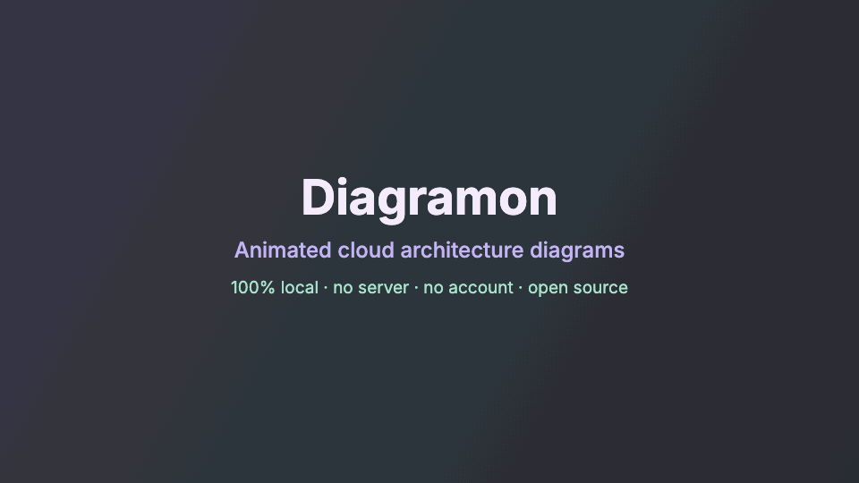

<div align="center">

**English** · [Español](README.es.md)


# Diagramon

**Animated cloud architecture diagrams that live 100% on your computer.**

No server. No account. No internet. Not a single byte of your customers' data leaves your machine.




<sub>Animated architecture · Security and Cost views · data lineage · resilience · C4 levels</sub>

</div>

---

## What is Diagramon?

Diagramon is an architecture workbench that you open from your disk. You draw a cloud architecture with official icons, and
the same diagram then answers the questions a review asks: what it costs, what breaks if one piece fails, where sensitive data
travels, who owns each part and which decisions shaped it. When you are done, it hands you the deliverables: images, a report,
an inventory or a password-protected copy for your client.

Architecture diagrams often hold the most sensitive facts a team has: customer names, account IDs, IP ranges, network layout
and real costs. That is why Diagramon has no server at all. It is one HTML page with plain JavaScript files, and the browser
itself blocks every network request.

## 🚀 Get started in 30 seconds

**Just want to try it?** Open the [online demo](https://dataengileb.github.io/diagramon/). It is the same page, served by GitHub Pages: your diagram stays in your browser.

1. **Download** the project: green **Code › Download ZIP** button, or with git:

   ```bash
   git clone https://github.com/dataengileb/diagramon.git
   ```

2. **Open** `index.html` with a double-click in any modern browser.
3. That's it. There is no step 3. 🎉

The app opens in English. Click the 🌐 **EN** button in the top bar, or press **`L`**, to switch to Spanish.

---

## ✨ What you can do

### Draw

- ☁️ **Official icons** for **AWS, Azure, Google Cloud, SAP BTP and Microsoft Fabric** (about 290 services), plus generic ones.
- 🧩 **Nested groups** (region › VPC › subnet, cluster › namespace), multi-select, alignment and smart guides.
- 🎞️ **Living diagrams**: particles travel along the connections, and **Flow** plays a path step by step. Curved or right-angle connectors that route around the nodes.
- ⌨️ **Diagram as code**: type a short text and the canvas updates live. Text, JSON and canvas always stay in sync.
- 🏗️ **Start from your real infrastructure**: Terraform, CloudFormation/SAM, Kubernetes or Docker Compose files become a diagram grouped by VPC, subnet or namespace. A dbt `manifest.json` becomes datasets and lineage.
- 🔭 **Views and levels**: nine views of the same diagram (Context, Logical, Physical, Security, Data, Cost, Governance, Resilience…) and **C4 levels** to drill down from system to containers to components.

### Analyze

- 💵 **Costs** per component, with a breakdown by team or cost center and *current vs proposed* scenarios.
- 🛟 **Resilience**: availability (SLA), RPO/RTO, replicas, composite availability of a route and single points of failure.
- 🔐 **Security**: data classification (*PII, PCI, PHI*…), encryption in transit, an automatic security review, **STRIDE** threat modeling across trust boundaries, and compliance mapping (ISO 27001, GDPR, PCI DSS…).
- 🧭 **Data governance**: owners and stewards, data residency with a warning when sensitive data leaves its jurisdiction, bronze / silver / gold layers, a data catalog with **data contracts** and lineage from origin to consumption.
- 📡 **Planning**: tech radar with end-of-support dates, migration disposition (6R), phases and effort estimation.

### Decide and keep track

- 🗂️ **Versions and environments**: save *Version 1, 2, 3…* or *Development, QA, Production*, and compare any of them with the canvas.
- 📜 **Architecture decisions (ADR)**, **requirements** with a traceability matrix, a **RAID log**, and **stakeholders** with a RACI matrix and sign-offs.
- ⚑ **Review**: findings from every source in one tab (manual, security, STRIDE, resilience, compliance…), plus comment threads on any element.
- 📁 **Workspace**: open a folder of diagrams to get a systems map, lineage across diagrams, a portfolio export and a check of the design against the deployed infrastructure.

### Share

- 📤 **SVG** (animated) and **PNG** with a legend and title block, ready to hand in. **JSON** to keep working, and **Mermaid, PlantUML and draw.io** for other tools.
- 📑 **Architecture report** (PDF, Markdown or HTML), a **status report**, an **inventory** in CSV or Excel and data contracts in YAML.
- 🔒 **Encrypted sharing**: one password-protected HTML file that opens anywhere, and brings your reviewer's comments back.
- 🎤 **Present** full screen, group by group.

And the basics: undo and redo, autosave, automatic layout, dark, light and high-contrast modes, two palettes, and the whole UI in English and Spanish.

<div align="center">

</div>

---

## 🔒 Your data never leaves your machine

| | Diagramon | Typical cloud diagram tools |
|---|---|---|
| Where does your diagram live? | In your browser and in the files you export | On the vendor's servers |
| Account required? | No | Usually |
| Internet required? | No, not even for icons | Yes |
| Analytics or telemetry? | None | Often |
| Cloud AI for "text to diagram"? | No: the text language runs locally | Sometimes |

**How it is enforced**

- **One HTML page with plain JavaScript.** No third-party libraries, no CDN, no web fonts loaded from the internet, no trackers.
  The official icons are embedded in `assets/icons/*.js` and the three fonts in `assets/fonts/fonts.js` (base64).
- **The browser blocks the network.** `index.html` sets a Content Security Policy (`connect-src 'none'`).
  Even if someone added code that tried to send data, the browser would refuse it.
- **Open code.** You can read every line. There are no calls to `fetch`, `XMLHttpRequest`, `WebSocket` or `sendBeacon`.
- **Local autosave.** Work is saved in your browser's `localStorage`, on your machine.
  Exports are files that you decide where to keep.

> **Tips for sensitive data:** on a shared computer, use a private window or clear the site data when you finish.
> Also review your browser extensions: they can read the pages you open, this one included.
>
> **Only import files you trust.** JSON or infrastructure-as-code files from unknown sources should be treated like any downloaded file.

---

## 📚 Documentation

| Guide | What you will find |
|---|---|
| [📘 Tutorial](docs/guide.md) | Every feature step by step, from your first diagram to C4 levels, and the [keyboard shortcuts](docs/guide.md#keyboard-shortcuts) |
| [🏗️ Import infrastructure as code](docs/iac-import.md) | Terraform, CloudFormation/SAM, Kubernetes and Docker Compose to a diagram, with the sample files |
| [🔐 Share an encrypted diagram](docs/sharing.md) | A single password-protected HTML file that opens anywhere |
| [⌨️ Diagram as code](docs/text-format.md) | The *Text* tab syntax, in English and Spanish |
| [🎨 Customize](docs/customize.md) | Themes, palettes, types, rules and templates in `src/config.js` |
| [🗂️ Project structure](docs/project-structure.md) | What each file and folder does, and how the code is split |
| [🧭 Known gaps](docs/known-gaps.md) | What still needs testing outside the browser, small improvements not done yet, and limits by design |
| [🛣️ Ideas and possible improvements](docs/roadmap.md) | Larger changes open for contributors, such as connections between groups, and the ideas that are not planned |

---

## 🤝 Contributing

Contributions are welcome! Open an *issue* with your idea or send a *pull request*.

To keep the spirit of the project:

- **No external dependencies** and no build step: it must keep working with a double-click.
- **No network connections**: no analytics, CDN, web fonts loaded from the web or APIs (the fonts are bundled).
- Customizable things belong in `src/config.js`. New UI text goes in `src/i18n.js`, in both languages.

See [CONTRIBUTING.md](CONTRIBUTING.md) for the details, and [SECURITY.md](SECURITY.md) to report a vulnerability privately.

---

## 🙏 Credits

Diagramon is inspired by [**archify**](https://github.com/tt-a1i/archify) by [@tt-a1i](https://github.com/tt-a1i),
an agent skill that turns ideas, plans and codebases into interactive diagrams (MIT license).
Thank you for the inspiration. 💜

---

## 📄 License

Diagramon's code is **open source** under the [MIT license](LICENSE): use it, change it and share it freely,
including in commercial projects.

The bundled fonts are [Inter](https://github.com/rsms/inter), [IBM Plex Sans](https://github.com/IBM/plex) and [Fira Code](https://github.com/tonsky/FiraCode), under the SIL Open Font License 1.1
(copies in [`assets/fonts/OFL-Inter.txt`](assets/fonts/OFL-Inter.txt), [`assets/fonts/OFL-IBMPlexSans.txt`](assets/fonts/OFL-IBMPlexSans.txt) and [`assets/fonts/OFL-FiraCode.txt`](assets/fonts/OFL-FiraCode.txt)).

The **official icons** in `assets/icons/` belong to Amazon Web Services, Microsoft, Google and SAP, and are **not** covered by the MIT license.
AWS, Microsoft and Google allow their use in architecture diagrams under their own terms.
SAP BTP icons come from [SAP/btp-solution-diagrams](https://github.com/SAP/btp-solution-diagrams)
under the Apache 2.0 license (copy in [`assets/icons/LICENSE-SAP.txt`](assets/icons/LICENSE-SAP.txt)).
Microsoft Fabric icons come from Microsoft's official `@fabric-msft/svg-icons` package, under the MIT license
(copy in [`assets/icons/LICENSE-FABRIC.txt`](assets/icons/LICENSE-FABRIC.txt)), and follow the same usage rules as Azure icons.
SAP only publishes icons for its BTP services. Its business applications (S/4HANA, ECC, TM, EWM…) have no official icon,
so Diagramon shows them with the SAP logo.
The Azure, Google Cloud and SAP **logos** offered as group icons (an Azure subscription, a Google Cloud project, an SAP BTP account)
are trademarks of their owners, used only to identify the service. Sources and terms in [`assets/icons/LICENSE-LOGOS.txt`](assets/icons/LICENSE-LOGOS.txt).
Diagramon shows the icons unchanged: do not crop, rotate or distort them, and do not use them to represent your own product.
AWS, Azure, Microsoft Fabric, Google Cloud and SAP are trademarks of their respective owners. Diagramon is not affiliated with any of them.

<div align="center">
<sub>Made with 💜 and pastel colors. Your diagrams, on your machine.</sub>
</div>
