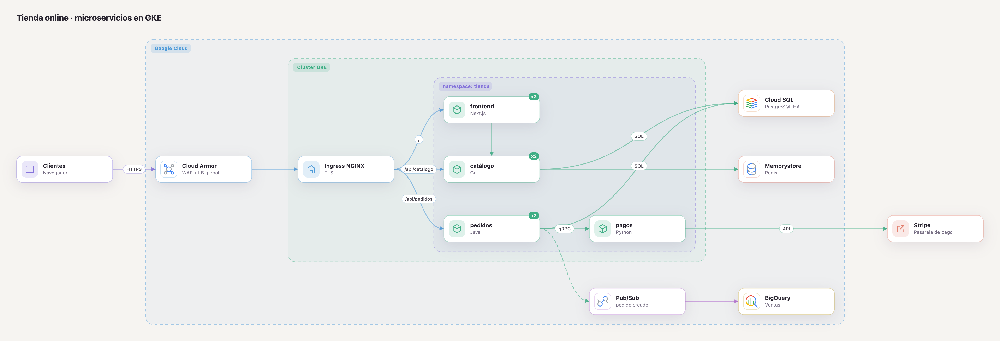

<div align="center">

**English** · [Español](README.es.md)


# Diagramon

**Animated cloud architecture diagrams that live 100% on your computer.**

No server. No account. No internet. Not a single byte of your customers' data leaves your machine.


</div>

---

## Why Diagramon?

Architecture diagrams often hold the most sensitive facts a team has: customer names, account IDs, IP ranges, network layout
and real costs. Most diagram tools ask you to upload all of that to someone else's cloud just to draw boxes and arrows.

**Diagramon does not.** It is a single HTML page that you open from your disk. It draws polished, animated diagrams with
around 290 official cloud icons, and the browser itself blocks every network request.

- **Private by design.** Your diagrams stay in your browser and in the files you export.
- **Zero setup.** Double-click `index.html`. No install, no build step, no sign-up.
- **Built for real architectures.** Official AWS, Azure, Google Cloud, SAP BTP and Microsoft Fabric icons, nested groups, costs and flow playback.
- **From your real infrastructure.** Drop a `terraform show -json`, a CloudFormation template, Kubernetes manifests or a `docker-compose.yml` and get the diagram, grouped by VPC, subnet or namespace.
- **Diagrams as code.** Type a short text and the canvas updates live. Text, JSON and canvas always stay in sync.
- **English or Spanish.** The app opens in English. One click switches it to Spanish.

---

## 🔒 Your data never leaves your machine

| | Diagramon | Typical cloud diagram tools |
|---|---|---|
| Where does your diagram live? | In your browser and in the files you export | On the vendor's servers |
| Account required? | No | Usually |
| Internet required? | No, not even for icons | Yes |
| Analytics or telemetry? | None | Often |
| Cloud AI for "text to diagram"? | No: the text language runs locally | Sometimes |

**How it is enforced**

- **One HTML page with plain JavaScript.** No third-party libraries, no CDN, no web fonts loaded from the internet, no trackers.
  The official icons are embedded in `icons/*.js` and the three fonts in `fonts/fonts.js` (base64).
- **The browser blocks the network.** `index.html` sets a Content Security Policy (`connect-src 'none'`).
  Even if someone added code that tried to send data, the browser would refuse it.
- **Short, open code.** You can read every line. There are no calls to `fetch`, `XMLHttpRequest`, `WebSocket` or `sendBeacon`.
- **Local autosave.** Work is saved in your browser's `localStorage`, on your machine.
  Exports (SVG, PNG, JSON) are files that you decide where to keep.

> **Tips for sensitive data:** on a shared computer, use a private window or clear the site data when you finish.
> Also review your browser extensions: they can read the pages you open, this one included.
>
> **Only import files you trust.** JSON or infrastructure-as-code files from unknown sources should be treated like any downloaded file.

---

## ✨ Features

- 🎞️ **Living diagrams**: particles travel along connections, dashed lines flow, and **Flow** plays the path step by step.
- ☁️ **Official icons** for **AWS, Azure, Google Cloud, SAP BTP and Microsoft Fabric** (about 290 services), plus generic icons.
- 🏗️ **Import infrastructure as code**: Terraform (state, plan or `.tfstate`), CloudFormation/SAM, Kubernetes and Docker Compose, parsed locally.
- 🧩 **Nested groups**: region › VPC › subnet, cluster › namespace, and more.
- 🖱️ **Multi-select, alignment and smart guides**: align, distribute with equal spacing, and snap to edges and centers.
- 💵 **Manual costs**: USD per hour, month, year or multi-year, shown under each service, with an approximate monthly total.
- 🏷️ **Data classification and encryption in transit**: tag nodes and connections as *Public, Internal, Confidential, PII, PCI* or *PHI*, mark each connection as encrypted 🔒 or not, and get a red warning when sensitive data travels unencrypted.
- ⌨️ **Diagram as code**: a small text language, with errors shown by line number.
- 🗂️ **Versions and environments**: save the canvas as *Version 1, 2, 3…* or as *Development, QA, Production*, open any of them, and compare it with the canvas: new items in green, changed in yellow, removed as red ghosts.
- ⚑ **Review findings**: raise a finding on any component by hand, with what must be fixed, who raised it, when, and the due date. Tags show *IN REVIEW*, *OVERDUE* or *RESOLVED*, and open findings are listed in the export.
- 🧭 **Data governance**: datasets on each connection with their **lineage** from origin to consumption, **owner, steward, team and cost center** per component (inherited from groups) with a **Governance** view, **region and jurisdiction** with a warning when sensitive data leaves it (*PII leaves the EU → US*), and **bronze / silver / gold** data lake layers with their own style and legend.
- 📐 **Elbow connectors**: switch between curves and right-angle lines that route around the nodes, for the whole diagram or one connection.
- 🧾 **Legend and title block** in SVG and PNG exports: connection styles, component colors, data classes, author, version, date and estimated cost. Ready to hand in.
- 🔦 **Flow highlighting** for any component: neighbors, targets, sources or everything.
- 🌐 **English and Spanish UI**: the 🌐 button in the top bar (or the **`L`** key) switches the language and remembers your choice.
- 🌗 **Dark mode** by default, **light** and **high-contrast black** modes with one key, and two palettes (Pastel and Neon).
- 📤 **Export** to SVG (animated), PNG or JSON. **Import** JSON by dropping it on the canvas.
- ↩️ **Undo and redo**, autosave and automatic layout.

<div align="center">

</div>

---

## 🚀 Get started in 30 seconds

**Just want to try it?** Open the [online demo](https://dataengileb.github.io/diagramon/). It is the same page, served by GitHub Pages: your diagram stays in your browser.

1. **Download** the project: green **Code › Download ZIP** button, or with git:

   ```bash
   git clone https://github.com/dataengileb/diagramon.git
   ```

2. **Open** `index.html` with a double-click in any modern browser.
3. That's it. There is no step 3. 🎉

Prefer Spanish? Click the 🌐 **EN** button in the top bar, or press **`L`**.

---

## 📘 Tutorial

### 1. Your first diagram

1. Open the **Templates** tab and pick *Web app on AWS (3 tiers)* to see a complete example.
2. Click **New** to start with an empty canvas.
3. In **Components**, open the **Provider** list and pick **Generic**, **AWS**, **Azure**, **Google Cloud**, **SAP BTP** or **Microsoft Fabric**.
   Only that provider's components are shown. Use the search box: `lambda`, `s3`, `hana`…
   It also matches synonyms and equivalents, in English and Spanish: `sql` finds RDS, Cloud SQL and Azure SQL; `k8s` finds EKS, AKS and GKE; `cola` finds SQS and Service Bus.
   For **SAP**, the **SAP business systems** (S/4HANA, ECC, TM, EWM…) appear at the top, with the SAP logo.
4. **Click** a component to add it to the center, or **drag** it onto the canvas.
   Double-click an empty spot on the canvas to add another one like the last.

### 2. Connect

- Select a node, press **`C`**, then click the target.
- Or select a node and **`⇧` + click** the target.
- Click a connection to change its label and style:
  **synchronous** (request), **asynchronous** (event), **data flow** or **optional**.

### 3. Edit and group

- **Click** a node: the right panel shows its name, detail, icon, color and description.
- To change the icon, type part of its name in the **Icon** search (`lamb`, `sql`, `kafka`…) and pick a suggestion with the mouse or with ↑ ↓ and Enter. The × goes back to the generic icon.
- **Double-click** a node, group or connection to rename it.
- Use **Group › + New group…** to create a group. Drag its label to move the whole group.

### 4. Many at once and alignment

- **`⌘` + click** (or **`Ctrl` + click**) adds or removes nodes from the selection.
- **`⇧` + drag** on the background selects an area. **`⌘A`** selects everything.
- With several nodes selected, the right panel can **align** them (left, center, right, top, middle, bottom)
  and **distribute** them with equal spacing, horizontally or vertically.
- With exactly two nodes selected, the right panel shows **Show path A → B** (or press **`R`**): the shortest route follows the arrows, lights up every edge of any shortest route and numbers the steps. If no directed route exists it falls back to ignoring direction and says so. **`Esc`**, the × or any click clears it.
- While dragging, pink **guides** snap the node to the edges and centers of the others. Hold **`Alt`** to turn them off.

### 5. Costs

1. Select a service.
2. Type the price in **Cost (USD)**.
3. Pick the period: **Hourly**, **Monthly**, **Yearly** or **Multi-year** (with a number of years).

The price appears in a tag under the service. The **approximate monthly total** is shown above the canvas.
With several services selected, the panel shows the cost of the selection.

> Diagramon never looks up prices online (privacy first). You type the costs yourself.

#### Breakdown and scenarios

Open **Costs…** from the *Export* menu, or from the **Costs** button in the pill of the **Cost** view (key `7`).

- **Breakdown** tab: group the monthly cost by **Team**, **Cost center**, **Owner**, **Group** (top-level), **Type**, **Provider**, **Region** or **Layer**. Each row shows the components, the monthly and yearly cost (monthly × 12) and its share of the total with a bar. Components without a value go to **Unassigned**. Click a row to filter the canvas by it (not available for *Type*).
- **Compare scenarios** tab: pick **A** and **B** among the canvas and every saved version. Version snapshots are used as they were saved; the canvas is not touched. You get the totals, the change (amount and %), per month and per year, a table per component (new in green, changed in yellow, removed in red; click a header to sort, *Only changes* hides the unchanged ones) and the change by team, cost center, owner…
- **Current vs proposed**: save the architecture as it is today as a version (e.g. *Approved*), change the canvas into the proposal and open the dialog: A is the latest approved version and B the canvas. **Save canvas as proposed scenario** saves a version called *Proposed* and selects it as B. In the **Versions** tab, **Compare costs** on any version opens the dialog with that version as A and the canvas as B.
- **CSV** exports the table that is shown (`<diagram>-costs.csv` or `<diagram>-cost-compare.csv`).
- The Cost view legend lists the 5 most expensive teams, a group's panel shows the group's monthly total, comparing a version on the canvas adds a *Cost: $A → $B* line, and the architecture report adds *Cost by team* and *Cost by cost center*.
- From the console: `Diagramon.costBreakdown(by)` returns `[{ key, label, monthly, nodes }]`; `Diagramon.compareCosts(aVersionId, bVersionId)` (`null` = canvas) returns `{ a: { label, monthly }, b: { label, monthly }, delta, deltaPct, rows: [{ id, label, a, b, delta, status }] }`; `Diagramon.openCosts('breakdown' | 'compare')` opens the dialog.

### Availability, RPO/RTO and single points of failure

1. Select a component and fill **Availability**: the **SLA %** target (pick a tier such as 99.9 or 99.99, or type `99.95`), **RPO** and **RTO** (`15m`, `4h`, `1d`, `0`) and **Replicas / instances**.
2. The panel shows the effective availability, assuming independent parallel instances: `1 − (1 − SLA)^replicas`, for example *99.9% with 2 replicas = 99.9999%*, plus the expected downtime (*≈ 32 s/year*). With several components selected, the fields apply to all of them.
3. Select two components and show the path between them: the path bar adds the **composite availability** of the shortest route (the product of every component on it; with several shortest routes, the worst one), the weakest link, and the largest RPO and RTO along it. Components without an SLA are counted and left out of the product.
4. Diagramon marks **single points of failure**: a component without replicas whose failure cuts an entry point (users, web, mobile, external or a component with no incoming flow) off from the rest. Single-instance data stores without an SLA of 99.9% or better, and data stores missing RPO/RTO (only when the diagram uses them anywhere), also show up in the *Review* tab under *Availability & resilience*. These findings appear only once the diagram uses SLA, RPO, RTO or replicas somewhere, so a diagram of managed services without availability data stays quiet; the **Resilience** view always shows the topological single points of failure.
5. Press **`9`** for the **Resilience** view: components are colored by effective availability (≥ 99.99%, ≥ 99.9%, ≥ 99%, below, or no SLA), single points of failure get a red dashed border, and a chip under each component reads *99.95% · RPO 15 min · RTO 1 h · ×2*.

From the console: `Diagramon.availability(fromId, toId)` returns `{ availability, downtimeYear, nodes, unknown, worst, rpo, rto }` (RPO and RTO in seconds) and `Diagramon.spofs()` returns `[{ id, label, reason }]`. The *Architecture report* has a **Resilience** section.

### 6. Data classification and encryption

1. Select a component. Under **Data classification**, click the tags for the data it stores or handles: **PUB**, **INT**, **CONF**, **PII**, **PCI**, **PHI**. You can pick several.
2. Select a connection. Set **Encryption in transit** to **Encrypted** or **Not encrypted**, and tag the **Data in transit**.

The tags appear on top of each node and on the connection's label, next to a padlock: closed 🔒 when encrypted, open when not.
When a connection marked *Not encrypted* carries sensitive data, or links a component with sensitive data, it turns red and a warning appears above the canvas.
With several components selected, the tags apply to all of them.

#### Data lineage

Mark which tables or datasets travel through each connection, then follow one from its origin to where it is consumed.

1. Select a connection. Under **Datasets**, type a table name and press `Enter` or `,` to add it (the field suggests names already used in the diagram). Click the **×** on a chip to remove it.
2. Click a dataset chip (or press `D` and pick one from the list, or click a row in the **Datasets** legend of the document card) to see its lineage: the whole route is highlighted, and each component gets a number (its depth). Origins are green, consumers orange.
3. The bar above the canvas summarizes it (*origins → consumers · hops*). `Esc` clears it. It also works in the *Context* view, where it is shown on the closed boxes and the combined connections between them.

Selecting a component lists the datasets on its connections. In the **Data** view the dataset names are drawn under each connection's label, and they are included in the exports. Connections drawn with arrows on both ends count in both directions.

#### Data residency

1. Select a component or a group and type its **Region** (a cloud region such as `eu-west-1`, `westeurope`, `europe-west1`, or a country code such as `ES`, `US`). The box suggests the regions already used in the diagram. Components inherit the region of the nearest group that has one; a group named like its region (`Region eu-west-1 (Ireland)`) is detected on its own and the panel says *inherited from…* or *deduced from…*.
2. Diagramon maps each region to a jurisdiction (EU, UK, US, Canada, Brazil, Latin America, Asia-Pacific, Middle East, Africa) and shows it next to the box. Unknown regions are simply ignored.
3. When a connection links two regions in different jurisdictions and carries sensitive data (its own classes or, if it has none, those of its source), the inspector shows `eu-west-1 (EU) → us-east-1 (US)` and a red warning such as *PII leaves the EU → US*. If the transfer is covered (SCCs, adequacy decision…), turn on **Transfer approved**: it stays listed but no longer raises the alarm.

The **Security** and **Physical** views show a small region chip on each component. In **Security**, unapproved cross-border connections are critical (red, with a globe marker) and their ends are highlighted; the legend gets a *Cross-border sensitive data* row and the summary above the canvas counts them. The filter has a **Cross-border** chip (in *Data*) and a **Region** section (one chip per jurisdiction, plus *Unknown region*). From the console: `Diagramon.crossBorder()`.

#### Data lake layers

Tag where a component sits in a medallion-style data lake.

1. Select a component or a group. Under **Data lake layer**, pick **Bronze**, **Silver** or **Gold** (or *None*).
2. Components inherit the layer of their group, so you can tag a whole zone once. The *None* button then reads *Inherited (Gold)* and a hint says which group it comes from.
3. Below the buttons, switch the document-wide naming between **Bronze · Silver · Gold** and **Raw · Curated · Serving**. It applies to every label, the legend and the filters.

A layered component gets a colored band on its left edge and a small layer label at its bottom-left corner. A group with its own layer gets a thicker, tinted border and a label next to its title.
The **Layers** legend (exports and the document card, key **I**) lists the layers in use; click a row in the document card to filter by it. The **Filters** menu has a *Layer* section, and the **Data** view highlights layered components.
The *Context* and *Cost* views hide layer marks. Scripts can read `Diagramon.layers()` and call `Diagramon.setLayerNames('zones')`.

### 7. Review findings

1. Select a component and click **⚑ Raise a review finding**.
2. Write the **Finding** (what must be fixed), **Raised by**, **Raised on** (today by default) and the **Due date**.
3. When it is fixed, click **✓ Mark resolved**. **Reopen** brings it back; **Remove** deletes it.

The component gets a tag: **IN REVIEW** (orange), **OVERDUE** (red, once the due date has passed) or **RESOLVED** (green).
The panel shows how many days are left or how late it is, and the summary above the canvas counts open and overdue findings.
Diagramon remembers the last reviewer name. Exports with the legend list the open findings with their due date.

#### Automatic security review

Diagramon checks the diagram for common security problems and **only warns, it never blocks anything**. The **Review** tab (next to *Versions*) lists every finding, grouped by source and severity, and its label shows the number of open findings in the color of the worst one. The same number appears in the line above the canvas (*⚑ N findings*), and in the **Security** view each component with findings gets a small *⚠ n* pill.

| Rule | Severity | Fires when |
|---|---|---|
| Sensitive data unencrypted | critical | A connection marked *Not encrypted* carries PII, PCI, PHI or confidential data |
| Encryption not stated | medium | A connection carries sensitive data but its encryption is not set |
| Public with sensitive data | high | A component that holds sensitive data is public |
| Data store without backup | medium | A database or storage has no backup component or backup connection |
| Unapproved cross-border transfer | high | Sensitive data crosses jurisdictions without an approved transfer |
| Sensitive data without owner | low | A component with sensitive data has no owner and no steward (only once the diagram assigns owners somewhere) |
| Public data store | high | A data store is public or is reached directly by users or an external service |

- **Exposure and backup are deduced.** A component is *public* when it sits in a public area (a group with the AWS public-subnet icon, or named *public*, *DMZ*, *internet*…) or receives a connection from users, a web or mobile app or an external service. A data store *has a backup* when it is connected to a backup component (AWS Backup, Recovery Services, a name with *backup*, *snapshot*, *replica*…) or to a connection labelled *backup*, *snapshot*, *replica*… In the component panel, **Security** shows the deduced value and why; choose **Public / Internal** or **Yes / No** to override it.
- **Dismiss** a finding to hide it: Diagramon asks for a short reason and stores it (with the author and date) in the diagram. **Show dismissed (N)** lists them with their reason and a **Restore** button.
- **Raise as review observation** turns a finding into a manual review observation on the component (see above), with the finding as its note.
- Click a finding's target to select it and zoom to it. Your own review observations appear in the same list (they cannot be dismissed: resolve them in the component panel).
- **Export CSV** saves all findings, dismissed ones included, for a spreadsheet.
- From the console: `Diagramon.findings({ dismissed: false })`, `Diagramon.dismissFinding(id, reason)` and `Diagramon.restoreFinding(id)`.

#### Compliance mapping

Tag which controls each component meets (ISO 27001, SOC 2, GDPR, HIPAA, PCI DSS) and export a matrix of component × control.

1. Select a component or a group and open the **Compliance** section of the panel (it opens by itself once a control is set).
2. Type in **Add control** to search the catalog (`iso27001:A.8.24 — Use of cryptography`) and pick one. It is added as **Gap**: nothing counts as met until you confirm it.
3. Set each control to **Met**, **Partial**, **Gap** or **N/A**. The **×** removes it.
4. Components **inherit** the controls of their groups: set `pcidss:1.3` once on the *Payments* group and every component inside gets it. Choosing a status on a component overrides the inherited one (the **×** then goes back to the inherited value).
5. **Suggested** chips offer controls for the data classes of the component (PII → GDPR Art. 32, 5, 25…; PCI → PCI DSS 3.5, 4.2…; PHI → HIPAA transmission security…) and for components on a cross-border connection (GDPR Art. 44–46). Click one to add it as a gap.
6. With several components selected, the same section applies to all of them.

**Compliance matrix** (button in the section, or **Export › Compliance matrix**): one row per component that has controls or sensitive data, one column per control in use grouped by framework, with ✓ met, ◐ partial, ✗ gap, — N/A and blank for not mapped. The header stays in view while you scroll; a row at the bottom shows the coverage of each control (met ÷ components that are not N/A) and cards on top summarize each framework. Pick a framework to narrow it down. **CSV** exports one row per component and one column per control (`met|partial|gap|na|`); **CSV (long)** one row per component × control with framework, control, title, group, status, inherited-from and data classes (`<diagram>-compliance.csv`, `<diagram>-compliance-long.csv`).

Review findings include a **Compliance** group: a gap is *medium* (*high* for a PCI DSS control on a component that handles PCI data, or HIPAA with PHI), a partial control is *low*, and a component with PII, PCI or PHI that lacks its main suggested control (for example GDPR Art. 32) is *low*, but only for frameworks the diagram already uses, so a diagram without controls stays quiet. The **Filter** gets a **Compliance** section (one chip per framework in use, plus *Has gaps*). From the console: `Diagramon.compliance()` and `Diagramon.exportCompliance('wide' | 'long')`.
The catalog lives in `config.js` › `compliance` and is a practical subset, not the full standards; the control titles are short paraphrases. This is a documentation aid, not an audit or a certification.

#### Owners and stewards

Say who is responsible for each component.

1. Select a component (or a group) and open the **Ownership** section of the panel (it opens by itself once a value is set).
2. Fill in **Owner**, **Data steward**, **Team** and **Cost center**. Each field suggests the values already used in the diagram, so names stay consistent.
3. Components **inherit** each field from the nearest group that has it: set the team once on a group and everything inside gets it. An inherited value shows as a gray placeholder with *inherited from <group>*; typing your own overrides it.
4. With several components selected the same four fields apply to all of them (*Mixed* when they differ; clearing a field clears it on all).

The tooltip of a component lists its owner, steward, team and cost center. The **Filter** panel gets **Team**, **Owner**, **Steward** and **Cost center** chips (plus *Unassigned* for owner and team). The document card (**`I`**) lists the **Teams** with their owners and component counts; click one to filter by it.
Press **`8`** for the **Governance** view: each component is colored by its team (or by its owner when it has no team), shows a small team chip underneath, and the exports and the legend list every team. From the console: `Diagramon.owners()` returns `[{ team, owners, stewards, nodes }]`.

### Filters

**Filter** (or **`G`**) opens a panel of chips: **Data** (each class in the diagram, plus *Unencrypted sensitive flows*), **Review**, **Provider**, **Category**, **Group**, **Cost**, and **Team**, **Owner**, **Steward** and **Cost center** when they are set.
Chips in the same section add up (OR); different sections combine (AND). What does not match fades out, including empty groups and connections whose ends do not both match, and selecting a component still works on top.
A pill above the canvas shows the active filter (`Filter: PII · AWS · 7 of 20`) with an **×** to clear it. The filter is remembered per browser and never changes the exports. From the console: `Diagramon.setFilter({ data: ['pii'], provider: ['aws'] })` and `Diagramon.clearFilter()`.

### 8. Versions and environments

Open the **Versions** tab.

- **+ Version N** saves a frozen snapshot of the canvas. Use it as your history: *Version 1*, *Version 2*…
- **DEV**, **QA** and **PROD** save the canvas as that environment. Each environment keeps one copy; saving again updates it.
- Add an optional **note** before saving, for example *before the migration*.
- **Open** loads it on the canvas. A pill above the title shows what is open and warns about unsaved changes.
- **Compare** marks the differences with the canvas: **green** is new, **yellow** changed, and **red dashed** ghosts were removed.
  The card lists every difference; click one to jump to it. **Esc** or **Stop** ends the comparison.
- Each card shows its **status**: **Draft**, **In review**, **Approved** or **Rejected**, also shown above the title and in the exported title block.
- **Version name**: in **✎**, give a version or environment an optional name such as `1.2`, `2026-Q4` or `MVP`. A number-like name shows as *Version 1.2*, any other as is, and an environment as *Production · 1.2*. It also feeds the title block.
- **✎** edits the status, the **architecture author**, the **created** and **updated** dates and the note, with no need to delete and save again. The last author you typed is suggested for new versions.
- Above the list, **status chips** (*All*, *Draft*, *In review*…) with their counts filter versions and environments; click the active chip again to show everything.
- Updating an environment that was **Approved** or **Rejected** puts it back **In review**, because its content changed.
- Updating or deleting an **Approved** version or environment asks for confirmation first. Approving one that still has **open review findings** in its snapshot warns you, lists them, and keeps the previous status if you cancel. A card that is approved with open findings shows a coral **⚑ open findings** flag.
- Approving or rejecting records **who decided and when** (shown on the card and in the exported title block). A rejection asks for a **reason**, and every status change is kept in a **status history** you can read in the edit form.
- Saving, opening, deleting and every edit can be undone with **`⌘Z`**.
- Versions are stored inside the diagram, so **Export › JSON** carries them all.

#### Architecture decisions (ADR)

Open the **ADR** tab to record *why* the architecture is the way it is, in the MADR style: **context**, **decision** and **consequences**.

- **+ New decision** adds a card (`ADR-001`, `ADR-002`…). Click it to edit its title, **status** (*Proposed*, *Accepted*, *Rejected*, *Deprecated*, *Superseded*), date, deciders and the three texts. Choosing **Superseded by** marks it *Superseded*.
- Link a decision to what it affects: **Link selection** links the selected components, connection or group, and **Link version…** a saved version. Linked items show as chips; click one to select it on the canvas (or to jump to the version).
- The component, connection and group panels have a **Decisions** field with the linked ADRs, **+ New decision** (already linked) and **Link…** to pick an existing one. Each version card lists its ADRs and has **+ ADR**.
- Components with a *proposed* or *accepted* decision show an **ADR n** tag on the canvas (views that show review marks); hover it to read the titles.
- Status chips with counts and a search box filter the list. **Export Markdown** downloads every decision as one `.md` file: an index table plus one section per ADR.
- Every status change is recorded in a **history** (date, status, who — your author name — and a note you can edit on the last entry), shown in the card, the Markdown export and the report. Older decisions show one entry with their current status and date.
- Each version also stores a copy of the decisions. When you **compare** a version, the ADR tab marks every decision as new, changed (with the fields and old → new status) or unchanged, lists removed ones at the end, and the compare bar adds the ADR counts. Versions saved before this feature have no decisions and get no marks. API: `Diagramon.compareDecisions(id)`.
- A decision *proposed* for more than 30 days is a low finding in the **Review** tab.
- Decisions belong to the document, not to a version: opening a version or editing the *Text* tab keeps them, and they are saved in **Export › JSON** under `decisions`. Everything can be undone with **`⌘Z`**.
- From the console: `Diagramon.decisions()`, `Diagramon.addDecision({ title, status, context, decision, consequences, links: { nodes: [...] } })`, `Diagramon.updateDecision(id, patch)`, `Diagramon.removeDecision(id)` and `Diagramon.exportDecisions()`.

### 9. Sticky notes and risk zones

Use the two buttons next to the zoom controls (bottom right of the canvas).
- **Add a sticky note** puts a note in the middle of the view. Double-click it (or use the panel) to write.
- **Add a risk zone** draws a hatched, dashed area under the groups, with a tag like `⚠ HIGH · Public subnet exposure`. Pick its **Severity** (*Low, Medium, High, Critical*) and an optional description in the panel.
- Select several components and click **⚠ Mark as risk zone** to draw a zone around them.
- Drag to move, drag the corner handle to resize (it snaps to the grid), **`⌘D`** duplicates and **Delete** removes. Everything can be undone.
- The summary above the canvas counts the zones (*⚠ 2 risk zones (1 critical)*), exports with the legend list them by severity, and versions and JSON files keep notes and zones.

#### Threat modeling (STRIDE)

Some zones are **trust boundaries** instead of risk zones: open a zone and switch **Kind** to *Trust boundary* (or select components and click **Trust boundary** next to *Mark as risk zone*). A trust boundary has a name, an optional **Trust level** (*Internet, DMZ, Internal, Restricted*…) and a description. It is drawn with a bold dashed line, no hatch, and a tag like `TRUST BOUNDARY · DMZ` with a shield; the legend and the document card list boundaries apart from risk zones.
- A component is inside a boundary when its center is inside the zone. Zones can nest or overlap. A connection **crosses** a boundary when its two ends are not in the same set of boundaries.
- Select a crossing connection: the **Threats (STRIDE)** section shows *Crosses: ‹Internet› → ‹DMZ›* and one suggestion per category (**S**poofing, **T**ampering, **R**epudiation, **I**nformation disclosure, **D**enial of service, **E**levation of privilege) with a severity from simple rules (encryption, sensitive data, inbound direction, target is a data store or identity component).
- Decide each one: **Open · Mitigated · Accepted · N/A**, with a note (what you did, or why). Only decisions are saved, and every change can be undone. Open threats show up as findings under *STRIDE threats*.
- In the **Security** view crossing connections get a small `STRIDE n` pill (n = open threats). **Export › Threat model (CSV)** writes one row per crossing connection and category (`<diagram>-stride.csv`).
- From the console: `Diagramon.threats()` returns `[{ edge, from, to, zones, category, severity, status, note }]` and `Diagramon.exportThreats()` downloads the CSV.

### 10. Present and export

- **Flow** (or **`P`**) lights up the diagram step by step, from clients to data. Bidirectional connections are followed both ways.
- **Present** (or **`V`**) goes full screen with no panels: an overview with the title, then one slide per group (in reading order, zooming in and dimming the rest) and a closing overview. Without groups it steps through the flow. **`→`**, **`Space`** or click go forward, **`←`** goes back, **`Home`/`End`** and number keys jump, **`P`** plays the flow, **`Esc`** exits and restores your view. Editing is off while presenting.
- **Arrange** lays everything out automatically, following the flow. Each group is arranged inside its own box, so groups never overlap. **Fit** (or **`F`**) centers the diagram.
- **Elbows** (or **`E`**) switches the connections between curves and right-angle lines that go around the nodes. Several elbow lines on the same side of a node leave from separate, evenly spaced points so they never overlap.
  To change only one connection, select it and pick its **Line**.
- **Export** › SVG, PNG or JSON. Keep the JSON to open it again later with **Import**.
- **Export › Mermaid, PlantUML or draw.io** turns the diagram into code or a file for other tools: a Mermaid flowchart (renders in GitHub, GitLab and Notion), a PlantUML diagram with no external includes, or a `.drawio` file that keeps the same layout, nested groups and official icons.
- **Export › Encrypted HTML** creates one `.html` file to share a diagram privately. Whoever receives it double-clicks it, types the password and sees the diagram (dark or light, with zoom). No app, no install, no download. Details below.
- The **Export** menu also has **Legend and title block** (on by default), with **Author** and **Version** fields.
  SVG and PNG files then get a panel at the bottom with only what the diagram uses (connection styles, padlocks,
  component colors, data classes) and a title block with title, author, version, date and estimated cost.

#### Architecture report

**Export › Architecture report…** builds the document architecture review boards ask for, with no libraries and no network:

- **Format**: **PDF** (opens your browser's print dialog on a print-ready A4 document: choose *Save as PDF*), **Markdown** (`.md`) or **HTML** (`.html`, one self-contained file, the same document as the PDF with no external requests).
- **Sections** (all on by default, remembered): Summary · Diagram · Components · Connections · Data classification & residency · Owners · Data lake layers · Costs · Security findings · Compliance · Threat model · Decisions (ADR) · Version history · Notes & risk zones. A section with no data is skipped and shown as *(none)*.
- **Diagram**: pick which of the 9 views to include (the active view, plus Security and Data when they add something). If the diagram has internal diagrams (C4 levels), **Include internal diagrams** renders each one. Images use the light theme by default (good for print); **Use current theme** keeps the one on screen.
- **Markdown images** are embedded as `data:` PNGs. Some Markdown viewers block them, so tick **Save images as separate files** to download the PNGs next to the `.md` and reference them by file name.
- Texts come out in the current interface language, dates and money in the document's formats, and everything is escaped.
- From the console: `Diagramon.exportReport({ format: 'pdf' | 'md' | 'html', sections?: [...], views?: [...], scopes?: true | false, theme?: 'light' | 'current', separateImages?: boolean })` returns a promise with the generated HTML or Markdown after starting the download or the print dialog. Section keys: `summary diagram components connections data owners layers costs findings compliance threats decisions versions notes`.

#### Inventory (CSV / Excel)

**Export › Inventory (Excel)** and **Export › Inventory (CSV)…** turn the diagram into a table for a CMDB or an audit, fully offline and with no libraries.

- **Components** (one row per component, every C4 level): ID, name, detail, type, provider, service, category, C4 kind and level path, group path, owner, data steward, team and cost center (the effective value, plus an *Inherited from* column when a group supplies it), region and jurisdiction, data classes, sensitive (yes/no), data lake layer, exposure and backup (effective), encrypted connections in and out, unencrypted sensitive connections, SLA, RPO, RTO, replicas, cost as entered, period, cost per month and per year, review status, open findings, linked ADRs, a compliance summary (for example *ISO 27001: 3 met / 1 gap*) and the description.
- **Excel** (`.xlsx`) has one sheet per table: Components, Connections (encryption, data classes, datasets, cross-border, transfer approved, open STRIDE threats), Groups, Owners (per team), Decisions, Findings (with dismissed ones and their reason) and Versions. Empty tables are skipped. The header row is bold, frozen and filterable, columns are sized to their content, costs use a currency number format and SLA keeps three decimals.
- **CSV** opens a small dialog: *Components only* (`<diagram>-inventory.csv`) or *All tables as separate CSV files* (one download per table, named `<diagram>-inventory-<table>.csv`). The files include the BOM so Excel respects accents.
- From the console: `Diagramon.inventory()` returns the component rows, and `Diagramon.exportInventory('xlsx' | 'csv' | 'csv-all')` starts the download.

### Views

A **view** is a way of looking at the same diagram: it only decides what is shown, how much detail and what stands out. It never changes your components or positions. Pick one from the **View** selector in the top bar, with keys **`1`**–**`9`**, or from the console (`Diagramon.setView('security')`). When the view is not *Full*, a pill above the canvas names it, counts what it hides or dims, and has an **×** to go back. The document card and the legend of exports follow the active view.

| Key | View | What you see |
|---|---|---|
| `1` | **Full** | Everything: components, groups, labels, tags, costs, zones and notes |
| `2` | **Context** | Top-level groups as closed boxes with combined flows between them (read-only; double-click a box to open it in Full) |
| `3` | **Logical** | Services and flows without the physical groups (VPCs, subnets, regions, accounts…) |
| `4` | **Physical** | Where things run: all groups and risk zones, without connection labels |
| `5` | **Security** | Sensitive data and encryption in transit highlighted (unencrypted, or not stated, with sensitive data); the rest fades |
| `6` | **Data** | Data stores and flows, colored by their most sensitive classification |
| `7` | **Cost** | Monthly cost as a heat map, with the total |
| `8` | **Governance** | Who owns what: components colored by team (or owner), with a team chip under each; components with neither fade |
| `9` | **Resilience** | Availability tiers (effective SLA), RPO/RTO chip under each component and single points of failure with a red dashed border |

The rules of each view live in `config.js` › `views`; groups can be marked `logical` or `physical` in the inspector.

### C4 levels (drill-down)

One file can hold several levels of detail, as in the **C4 model**: *system context* → *containers* → *components*. Any component can have an **internal diagram**; the model stays flat (each element just says which component it lives `in`), so reviews, lineage, compliance, owners, costs and versions keep seeing everything.

1. Select a component and press **Create internal diagram** in the inspector (**C4 element** section), then add components inside it. New components, groups, notes and zones take the level you are in. Inside a *Software system* they default to *Container*, inside a *Container* to *Component*.
2. A component that has an internal diagram shows a **⊞ n** chip on the right of its card. **Click the chip**, **double-click the component** (double-click its *name* to rename), press **`Enter`** with it selected, or use **Open internal diagram** in the inspector.
3. Go back with **`Esc`** (with nothing selected), **`Alt`+`↑`** or the **breadcrumb** above the canvas (*Top › Shop system › API*), which also names the C4 level (*L1 System context*, *L2 Containers*, *L3 Components*).
4. Inside a level, a dashed **boundary frame** carries the parent's name and C4 type. What lives outside but connects to it (other systems, the parent's neighbours) appears as dimmed **ghost cards** left (incoming) and right (outgoing) of the frame; click one to jump to its level.
5. Pick a **C4 element** (*Person*, *Software system*, *Container*, *Component*, *External system*) in the inspector; it shows as a `[Container]` tag on components without a detail line, and in the tooltip.
6. **Move into…** (nodes you selected go inside another component of the same level) and **Move up a level** are in the inspector; connections follow, and groups travel with their nodes when all of them move. Deleting a component with an internal diagram asks first, and deletes everything inside it. **Duplicate** also copies the internal diagram, at every depth.
7. Each level has its own positions and its own **Auto layout**, **Fit** and presentation. Views (*Context* collapse included), filters, findings and exports all work inside the open level. **Export** › *All levels* writes one image per level with content.

From the console: `Diagramon.setScope('api')`, `Diagramon.scope`, `Diagramon.scopes()`, `Diagramon.exportLevels('png')`.

### Keyboard shortcuts

| Key | Action |
|---|---|
| `⌘Z` / `⇧⌘Z` | Undo / redo |
| `⌘D` | Duplicate |
| `⌘A` | Select all |
| `Delete` | Delete |
| Arrows (`⇧` = faster) | Move the selection (nodes, notes and risk zones) |
| `Alt`+click | Select the risk zone under the pointer, even if nodes or groups cover it |
| `Z` / `⇧Z` | Select the next / previous risk zone |
| `C` | Connect |
| `F` | Fit to view |
| `P` | Play the flow |
| `R` | Show the path between two selected nodes |
| `D` | Pick a dataset to show its lineage (type to filter, `↑` `↓` `Enter`, `Esc` closes) |
| `V` | Present full screen (`→` `←` `Space` `Home` `End` `1`–`9`, `Esc` to exit) |
| `T` | Cycle light → dark → high-contrast black mode |
| `L` | Switch English / Spanish |
| `E` | Switch curved / elbow connectors |
| `G` | Open the filter panel (`Esc` closes it) |
| `1`–`9` | Switch view: Full, Context, Logical, Physical, Security, Data, Cost, Governance, Resilience |
| `Enter` | Open the internal diagram of the selected component (C4 levels) |
| `Esc` | Cancel or clear the selection; with nothing selected, go up one C4 level |
| `Alt`+`↑` | Go up one C4 level |

---

## 🏗️ From infrastructure as code to diagram

Drop your IaC files on the canvas, or use **Import**. Diagramon draws the real architecture in seconds, and nothing is uploaded anywhere: parsing runs in your browser.

| Source | How to get the file |
|---|---|
| **Terraform** | `terraform show -json > infra.json` (state), `terraform show -json plan.out` (plan) or the `.tfstate` file itself |
| **CloudFormation / SAM** | The template, in YAML or JSON |
| **Kubernetes** | Your manifests (several documents per file, several files at once), or `kubectl get all,ingress,pvc,secret -o yaml` |
| **Docker Compose** | `docker-compose.yml` / `compose.yaml` |

What you get:

- **Groups**: AWS region › VPC › subnets (Azure resource groups and VNets, Google Cloud VPCs), Kubernetes namespaces and Compose networks.
- **Connections** deduced from references: ARNs, ids, bucket names, `s3://` paths, hostnames in environment variables, Kubernetes selectors and Ingress rules, `depends_on`. The direction follows the data: a Firehose *source* stream points to the Firehose, and an S3 notification points to the Lambda it triggers.
- **Official icons** and details: runtime, engine, schedule, replicas.
- **Data classification** from tags such as `DataClassification = pii`.
- **Less noise**: supporting resources (IAM, policies, routes, security groups, attachments…) are hidden, but still used to place and connect the rest.


Try it with the files in [`samples/`](samples): a simple AWS data lake (as Terraform and as CloudFormation), a Kubernetes shop and a Docker Compose stack.

---

## 🔐 Share an encrypted diagram

**Export › Encrypted HTML** asks for a password (12 characters or more, with a strength meter) and saves a single `.html` file.

- **Self-contained and view only.** The file carries its own small viewer. It opens in any recent browser with a double click, offline, with no Diagramon, no install and no download.
- **Everything is encrypted**, the title too. In clear there are only the encryption parameters.
- **Strong, standard crypto** from the browser (Web Crypto): the key comes from the password with PBKDF2-SHA-256 and 600,000 iterations and a random 16-byte salt; the diagram is compressed and encrypted with AES-256-GCM (random 12-byte IV), which also detects any tampering.
- **The viewer cannot leak or run anything.** It blocks the network with its own Content Security Policy and shows the diagram as an image.
- Send the password through a **different channel** than the file. A lost password cannot be recovered.

---

## ⌨️ Diagram as code (*Text* tab)

The fastest way to draw. Type, and the canvas updates by itself. Everything runs locally, with no AI.

```text
title: Online store
direction: LR
lines: elbow
author: Platform team
version: 1.2

group aws "AWS" color=peach {
  api: API Gateway [aws/apigateway] "REST"
  db: RDS Postgres [rds] "Multi-AZ" badge=x2 cost=350/month data=pii,pci
}
web: Customers [user] desc="Browser"

web -> api : HTTPS
api => db : SQL encrypted=yes
api ~> queue : events
```

| Write | Meaning |
|---|---|
| `id: Name [type] "detail"` | Node. `[type]` is a generic type (`db`, `user`…) or an official icon (`aws/lambda`, `rds`) |
| `id: name="Store [legacy]" [db]` | Node whose name contains quotes, brackets, braces or `key=value` (Spanish: `nombre="…"`); written automatically when needed |
| `color=… badge=… desc="…"` | Node options |
| `cost=120/month` · `0.1/hour` · `1400/year` · `5000/3years` | Cost in USD (no period = monthly) |
| `sla=99.95` · `rpo=15m` · `rto=4h` · `replicas=2` | Availability target in % (also `99.95%` or `99,95`), recovery point and time objectives (`s`, `m`, `h`, `d`) and parallel instances; Spanish: `réplicas=` |
| `data=pii,pci` | Data classification of a node or a connection |
| `owner="Ana Pérez" steward=… team="Data Eng" costcenter=CC-100` | Ownership of a node or group (Spanish: `dueño=` `responsable=` `equipo=` `centro=`); nodes inherit from their group |
| `a -> b : TLS encrypted=yes` | Encryption in transit (`yes` or `no`) |
| `a -> b : SQL datasets=orders,customers` | Datasets carried by a connection (Spanish: `tablas=`); quote names with spaces: `datasets="sales orders,crm.customers"` |
| `region=eu-west-1` | Region of a node or a group (aliases `country=`, `país=`, `región=`); nodes inherit it from their group |
| `a -> b : x data=pii transfer=ok` | Cross-border transfer approved (`transferencia=ok` in Spanish) |
| `a -> b : SQL threats="T=mitigated,I=accepted"` | STRIDE decisions of a connection (Spanish: `amenazas=`); letters `S T R I D E`, statuses `mitigated`, `accepted`, `na` (Spanish `mitigada`, `aceptada`, `na`) |
| `threat api -> db T: "TLS 1.3 everywhere"` | Note on a decided STRIDE threat (Spanish: `amenaza`); the connection is found by `from -> to` (any arrow); if several connections share them, `#2` picks the second: `threat api -> db #2 T: "…"`. The threat must already have a status (`threats=…`), otherwise it is an error |
| `note n1: "Text\nmore" at=120,40 size=180,110 color=lemon` | Sticky note (Spanish: `nota n1: "…" en=120,40 tamaño=180,110`); `\n` is a line break; position and size are optional |
| `zone z1: "PCI scope" severity=high at=… size=… desc="…"` | Risk zone (Spanish: `zona`, `severidad=alta`; severities `low`, `medium`, `high`, `critical` · `baja`, `media`, `alta`, `crítica`) |
| `trust t1: "DMZ" trust=internet at=… size=… desc="…"` | Trust boundary (Spanish: `confianza t1: "DMZ" confianza=internet …`) |
| `dismiss sec:public-db:db: "Accepted risk" by="Ana" date=2026-10-01` | Dismissed finding (Spanish: `descartar … por=… fecha=…`). The id may contain `:` (the separator is the first `:` followed by a space) or be quoted: `dismiss "sec:x:y": "reason"` |
| `group id "Name" color=… { … }` | Group; groups can be nested |
| `in=shop` (Spanish: `dentro=shop`) · `c4=container` | C4 levels: the node or group lives in the internal diagram of `shop`; C4 type `person`, `system`, `container`, `component` or `external` (Spanish: `persona`, `sistema`, `contenedor`, `componente`, `externo`). Nodes inside the braces of a group with `in=` inherit its level |
| `inside shop { … }` | C4 level block (Spanish: `dentro tienda { … }`): everything declared inside (nodes, groups, notes, zones) lives in the internal diagram of `shop`, without writing `in=` on each. Blocks nest (`inside api { … }` inside `inside shop { … }` requires `api` to be a node of `shop`); groups work inside a block, but a block cannot be opened inside a group. `in=` still works |
| `layer=gold` (`bronze`, `silver`, `gold`; also `raw`, `curated`, `serving`) | Data lake layer of a node or group (Spanish: `capa=oro`); nodes inherit it from their group |
| `layers: zones` | Show Raw / Curated / Serving instead of Bronze / Silver / Gold (Spanish: `capas: zonas`) |
| `exposure=public` (`internal`) · `backup=yes` (`no`) | Override the deduced exposure and backup of a node (Spanish: `exposición=pública` / `interna`, `respaldo=sí` / `no`) |
| `controls="iso27001:A.8.24=met,pcidss:4.2=gap"` | Compliance controls of a node or group (Spanish: `controles=`, states `cumple` `parcial` `brecha` `na`); each is `framework:id=met\|partial\|gap\|na`; nodes inherit from their group |
| `a -> b` · `a => b` · `a ~> b` · `a ..> b` | Request · data · event · optional |
| `a -> b -> c : label` | Chain; the label goes on the last arrow |
| `lines: elbow` · `a -> b : x line=curved` | Elbow or curved lines, for the diagram or one connection |
| `author: …` · `version: …` | Shown in the export's title block |
| `review db: "DB in a public subnet" by=Ana raised=2026-10-01 due=2026-11-15` | Review finding (`status=resolved closed=…` when fixed) |
| `# …` or `// …` | Comment |

Keywords work in English and Spanish (`title`/`título`, `group`/`grupo`, `cost`/`costo`, `/month`/`/mes`…).
The text is the source of truth for notes, zones, trust boundaries, STRIDE notes and dismissed findings: deleting them from the text deletes them from the diagram. Versions and architecture decisions (ADR) are kept.
A node that only appears in a connection is created for you. Errors are shown in red with their line number.
The text does not store positions: existing nodes stay where they are, and new nodes are placed next to their neighbors.

<details>
<summary><b>JSON format</b></summary>

```json
{
  "title": "My architecture",
  "direction": "LR",
  "groups": [ { "id": "vpc", "label": "VPC", "color": "cielo", "parent": "aws" } ],
  "nodes":  [ { "id": "api", "label": "API", "type": "gateway", "icon": "aws/apigateway", "sub": "REST", "badge": "x2",
                "group": "vpc", "x": 0, "y": 0, "cost": 0.05, "costPeriod": "hour", "desc": "…" } ],
  "edges":  [ { "from": "api", "to": "db", "label": "SQL", "style": "sync | async | data | optional", "color": "rosa" } ]
}
```

- Nodes only need `id` and `type`. Without `x`/`y` they are placed automatically.
- `costPeriod`: `hour`, `year` or `multi` (with `costYears`). Without `costPeriod` the cost is monthly.
- `routing: "elbow"` sets elbow lines for the diagram; `route` (`curved` or `elbow`) overrides it on one edge. `meta` holds `author` and `version`.
- `review` on a node: `{ "status": "open" | "resolved", "note", "by", "raised", "due", "closed" }`, dates as `YYYY-MM-DD`.
- `owner`, `steward`, `team` and `costCenter` (strings) on nodes and groups; a node without one inherits it from the nearest group that has it.
- `data` is a list of data classes (`["pii", "pci"]`) on nodes and edges. `encrypted` (`true` or `false`) is the encryption in transit of an edge.
- Exported files also carry `versions` (each with `kind`: `version` or `env`, and its own `diagram`) and `active`.
- `color` takes a palette key (`rosa`, `coral`, `melocoton`, `limon`, `menta`, `cielo`, `lavanda`, `lila`),
  its English name (`pink`, `coral`, `peach`, `lemon`, `mint`, `sky`, `lavender`, `lilac`) or any CSS color.

</details>

---

## 🎨 Customize

Everything you can customize is in **`config.js`**. Save and reload `index.html`.

- **Default theme**: `app.defaultTheme: 'dark' | 'light' | 'black'`. The `T` key and the theme button cycle light → dark → black.
- **Default language**: `app.defaultLang: 'en' | 'es'`. UI texts live in `i18n.js`; texts in `config.js` and `examples.js` can be `{ en: '…', es: '…' }`.
- **Data classes**: `dataClasses` sets the tags (name, short label, color). `sensitive: true` turns on the red warning for unencrypted flows.
- **Jurisdictions (data residency)**: `residency.jurisdictions` in `config.js` is an ordered map `key → { label: { en, es }, short, match }`. `match` is a case-insensitive RegExp tested against the region text (`eu-west-1`, `westeurope`, `ES`…); the first jurisdiction that matches wins, so put specific ones (`uk`, `ch`) before wide ones (`eu`). To add one, copy a line and change its key, labels and `match`; to adjust one, edit its `match` (anchor it with `^…$`). `of` is the optional text used in the warning (*leaves **the EU***). Set `residency.warnSameJurisdiction: true` to also warn when regions differ inside the same jurisdiction.
- **STRIDE threat rules**: `stride` in `config.js` sets the thresholds and the text. `inboundSeverity` is the severity of *Spoofing* on inbound crossings, `criticalClasses` the data classes that make *Information disclosure* critical, `storeTypes` and `storeIconCategories` what counts as a data store, secrets or identity component for *Elevation of privilege*, and `categories` the label, description and mitigation hint (`{ en, es }`) of each letter. The rules are explained in a comment above it.
- **Data lake layers**: `dataLayers` sets the layers in order (`label` for the medallion names, `alt` for the Raw/Curated/Serving names, short letters and `color`). Colors default to `--layer-bronze`, `--layer-silver` and `--layer-gold`, set per theme in `index.html`; edit them there or put a fixed color in `config.js`. `layerAliases` lists the other words accepted when reading JSON and text. Each view's `layers` flag shows or hides them.
- **Automatic security review**: `securityRules` in `config.js` has one entry per rule (`sec.unencrypted-sensitive`, `sec.unstated-encryption`, `sec.public-sensitive`, `sec.datastore-backup`, `sec.cross-border`, `sec.sensitive-no-owner`, `sec.public-datastore`) with `enabled` (set `false` to turn a rule off) and `severity` (`low`, `medium`, `high`, `critical`). The rest are the rule's parameters: `clientTypes`, `publicGroupIcons` and `publicGroupName` (what counts as public), `dataStoreTypes` and `dataStoreIconCategories`, `backupIcons`, `backupName` and `backupEdgeLabel` (what counts as a backup). Text patterns are case-insensitive RegExps.
- **Compliance**: `compliance.frameworks` is an ordered map `key → { label, short, url?, controls: { '<id>': { label: { en, es } } } }`. Add a control by adding a line in its framework, or a framework (NIST CSF, ENS, DORA…) by copying a block; JSON and Text accept any `framework:id`, even without a catalog entry. `compliance.suggest` maps each data class (and `crossBorder`) to the controls offered as chips; the first one of each list is the one the review expects.
- **Architecture decisions**: `adr.staleDays` (default `30`) is how many days a *proposed* decision can wait before it shows as a low finding in the *Review* tab; `0` turns it off.
- **Resilience**: `resilience` in `config.js` sets `entryTypes` (component types treated as entry points, besides any node with no incoming flow), `dataStoreTypes` and `dataStoreIconCategories` (what counts as a data store), `spofSeverity` and `singleStoreSeverity` (severity of the findings) and `defaultTarget` (SLA in % expected from a data store, default `99.9`).
- **Environments**: `environments` sets the buttons of the *Versions* tab (name, short label and color). Add or remove as many as you need.
- **Node size**: with `node.sameSize: true` (default) every node is `node.width` wide and long names wrap to 2 lines.
  With `false`, each node grows with its text.
- **Shortcuts without an official icon**: `presets` adds items at the top of a provider's list (for example, SAP systems).
- **Fonts**: pick Inter (default), IBM Plex Sans or Fira Code from the top bar; the choice is saved in your browser and embedded in SVG/PNG exports. They are bundled with the app (not loaded from the web). To add one, drop its `.woff2` files in `fonts/`, add an entry to `FONTS` in `tools/build-fonts.py` (see the header) and run `python3 tools/build-fonts.py`.
- **Palettes**: add an entry to `palettes` with the same color keys (`rosa`, `coral`, …) for `dark`, `light` and `black` (Pastel and Neon ship by default). A saved palette that no longer exists falls back to Pastel.
- **New component type**: copy an entry in `types` and change `label`, `category`, `color`, `keywords` and `icon` (a 24×24 SVG).
- **Connections**: `edgeStyles` sets dash, width and particle count.
- **Animation**: speed, entrance and step duration in `animation`.
- **Costs**: `cost.currency`, `cost.hoursPerMonth` (730 = hours in a month) and `cost.defaultYears`.
- **Templates**: add your own in `examples.js`.

<details>
<summary><b>Update or add official icons</b></summary>

1. Download the official packs: [AWS](https://aws.amazon.com/architecture/icons/),
   [Azure](https://learn.microsoft.com/azure/architecture/icons/), [Google Cloud](https://cloud.google.com/icons)
   (core products and category icons), [SAP BTP](https://github.com/SAP/btp-solution-diagrams)
   (folder `assets/shape-libraries-and-editable-presets/svg`) and [Microsoft Fabric](https://learn.microsoft.com/fabric/fundamentals/icons)
   (`Icons.zip`, folder `package/dist/svg`).
2. Unzip them into one folder with `aws/`, `azure/`, `gcp-core/`, `gcp-cat/`, `sap/` and `fabric/`.
   If a folder is missing, that cloud is skipped and its file is left untouched.
3. Add services to the lists in `tools/build-icons.py` (or set `ALL = True` to include them all).
4. Run:

   ```bash
   python3 tools/build-icons.py <folder>
   ```

Set `"icons": { "enabled": false }` in `config.js` to turn them off.

</details>

<details>
<summary><b>Extension API</b></summary>

`window.Diagramon` exposes `model`, `load()`, `addNode()`, `addEdge()`, `select()`, `align()`, `relayout()`,
`fitView()`, `togglePlay()`, `toggleTheme()`, `toggleLang()`, `lang`, `saveVersion()`, `openVersion()`, `compareVersion()`, `deleteVersion()`, `exportSVG()`, `exportPNG()`, `exportJSON()`, `lineage()`, `datasets()`, `owners()`, `crossBorder()`, `layers()`, `setLayerNames()`, `compliance()`, `exportCompliance()`, `inventory()`, `exportInventory()`, `decisions()`, `addDecision()`, `updateDecision()`, `removeDecision()`, `exportDecisions()`, `config` and `icons`.
Also: `setScope(id | null)`, `scope`, `scopes()` and `exportLevels(format)` for C4 levels.
The text language is in `window.DiagramonText` (`parse` and `stringify`). UI translations are in `window.DiagramonI18n`.

</details>

---

## 🗂️ Project structure

| File | Purpose |
|---|---|
| `index.html` | UI and styles. `#diagram-css` holds the styles that are also embedded in exports |
| `config.js` | **Everything you can customize**: themes, palettes, types, connections, animation and costs |
| `i18n.js` | UI texts in English and Spanish |
| `app.js` | Editor engine |
| `text-lang.js` | Text language (diagram as code) |
| `examples.js` | Templates |
| `export-mermaid.js`, `export-plantuml.js`, `export-drawio.js` | Exporters to Mermaid, PlantUML and draw.io |
| `export-xlsx.js` | Minimal ZIP and Excel (`.xlsx`) writer, no libraries (used by the inventory export) |
| `share.js` | Encrypted, self-contained HTML viewer for sharing |
| `iac.js` | Infrastructure-as-code import (Terraform, CloudFormation, Kubernetes, Compose) |
| `samples/` | Sample IaC files to try the import |
| `icons/*.js` | Embedded official icons for AWS, Azure, Google Cloud, SAP BTP and Microsoft Fabric |
| `tools/build-icons.py` | Builds `icons/*.js` from the official packs |
| `icons/logos.js`, `tools/build-logos.py` | Azure, Google Cloud and SAP logos for groups, built from `tools/logos/` |
| `fonts/` | Bundled fonts (`.woff2`, OFL licenses) and the generated `fonts.js` |
| `tools/build-fonts.py` | Builds `fonts/fonts.js` from `fonts/*.woff2` |

---

## 🧭 Known gaps

Things that work but have not been checked in depth yet. They probably need some debugging; reports and pull requests are welcome.

- **IaC import for Azure and Google Cloud**: the icon mapping exists, but it has not been tried with real Azure or Google Cloud files.
- **Mermaid, PlantUML and draw.io exports**: they cover the main cases, but complex diagrams may lose details or need fixes.
  Group icons in the draw.io export have not been opened in draw.io yet.
- **Light and black themes**: reviewed for the new marks, dialogs and group icons. Very light custom colors are darkened in the light theme (and very dark ones lightened in the dark themes) so borders and labels stay readable; mid-tone custom colors are kept as chosen.
- **Text tab round trip**: bidirectional connections, multi-line labels and component names with quotes, brackets or `key=value` were checked in English and Spanish (names that need it are written as `name="…"`).
- Notes and risk zones are not exported to Mermaid, PlantUML or draw.io.
- **Data governance** fields (datasets, owners, regions, layers) are not exported to Mermaid, PlantUML or draw.io. IaC import sets the region only for AWS (not yet from Azure `location` or Google Cloud regions).
- Region detection from a group's name covers the usual AWS, Azure and Google Cloud codes; other names need the **Region** field.
- **Very small components** carrying every pill at once (layer, region, team, availability) have not been reviewed; with the default fixed node width they fit.
- Security review, compliance and STRIDE fields (`exposure`, `backup`, `controls`, `threats`, trust zones, dismissed findings) are not exported to Mermaid, PlantUML or draw.io.
- **Architecture decisions** (ADR) are not part of the text format and are not exported to Mermaid, PlantUML or draw.io.
- The compliance catalog is a practical subset of each standard with paraphrased titles; check it before relying on it for an audit.
- **Single points of failure** are detected from the diagram topology only (articulation points of the undirected graph): Diagramon does not know about the internal redundancy of a load balancer or a managed service unless you set `replicas`. Effective availability assumes independent instances (no shared failures, no failover time), and the composite availability multiplies the components of one shortest route, so it ignores alternative longer routes.
- **Architecture report**: the PDF path was checked up to the browser print call (the full document, its 14 sections, images and tables load and `print()` is called), and tables fit an A4 page width; the print dialog itself and the final pagination depend on the browser. Page headers and numbers appear only where the browser supports CSS `@page` margin boxes. Markdown viewers that block `data:` images show nothing for the diagrams unless you save the images as separate files. Large diagrams with many views and internal levels can take several seconds. The Compliance matrix is listed per control and per component rather than as a grid.
- **Cost scenarios** compare only the monthly-equivalent price of components (not edges or groups), and *Group* groups by the top-level group only. The breakdown is not exported to Mermaid, PlantUML or draw.io.
- **C4 levels**: Mermaid, PlantUML and draw.io export the whole flat model (no levels; `in` and `c4` are ignored). Ghost cards show at most 8 per side, and connections between two levels are only drawn as ghosts (reach them from the inspector links). Renaming a component with a double-click on its name uses the browser's prompt.
- **Inventory (Excel)**: the `.xlsx` file is written by a minimal built-in writer (a ZIP without compression), so it is larger than one saved by Excel. It has no formulas (totals are not calculated in the file), no shared strings and no charts. It was checked as a valid ZIP with well-formed XML parts, but not opened in Excel, Numbers or LibreOffice yet. Several CSV downloads in a row may trigger a "download multiple files" prompt in some browsers.

---

## 🤝 Contributing

Contributions are welcome! Open an *issue* with your idea or send a *pull request*.

To keep the spirit of the project:

- **No external dependencies** and no build step: it must keep working with a double-click.
- **No network connections**: no analytics, CDN, web fonts loaded from the web or APIs (the fonts are bundled).
- Customizable things belong in `config.js`. New UI text goes in `i18n.js`, in both languages.

See [CONTRIBUTING.md](CONTRIBUTING.md) for the details, and [SECURITY.md](SECURITY.md) to report a vulnerability privately.

---

## 🙏 Credits

Diagramon is inspired by [**archify**](https://github.com/tt-a1i/archify) by [@tt-a1i](https://github.com/tt-a1i),
an agent skill that turns ideas, plans and codebases into interactive diagrams (MIT license).
Thank you for the inspiration. 💜

---

## 📄 License

Diagramon's code is **open source** under the [MIT license](LICENSE): use it, change it and share it freely,
including in commercial projects.

The bundled fonts are [Inter](https://github.com/rsms/inter), [IBM Plex Sans](https://github.com/IBM/plex) and [Fira Code](https://github.com/tonsky/FiraCode), under the SIL Open Font License 1.1
(copies in [`fonts/OFL-Inter.txt`](fonts/OFL-Inter.txt), [`fonts/OFL-IBMPlexSans.txt`](fonts/OFL-IBMPlexSans.txt) and [`fonts/OFL-FiraCode.txt`](fonts/OFL-FiraCode.txt)).

The **official icons** in `icons/` belong to Amazon Web Services, Microsoft, Google and SAP, and are **not** covered by the MIT license.
AWS, Microsoft and Google allow their use in architecture diagrams under their own terms.
SAP BTP icons come from [SAP/btp-solution-diagrams](https://github.com/SAP/btp-solution-diagrams)
under the Apache 2.0 license (copy in [`icons/LICENSE-SAP.txt`](icons/LICENSE-SAP.txt)).
Microsoft Fabric icons come from Microsoft's official `@fabric-msft/svg-icons` package, under the MIT license
(copy in [`icons/LICENSE-FABRIC.txt`](icons/LICENSE-FABRIC.txt)), and follow the same usage rules as Azure icons.
SAP only publishes icons for its BTP services. Its business applications (S/4HANA, ECC, TM, EWM…) have no official icon,
so Diagramon shows them with the SAP logo.
The Azure, Google Cloud and SAP **logos** offered as group icons (an Azure subscription, a Google Cloud project, an SAP BTP account)
are trademarks of their owners, used only to identify the service. Sources and terms in [`icons/LICENSE-LOGOS.txt`](icons/LICENSE-LOGOS.txt).
Diagramon shows the icons unchanged: do not crop, rotate or distort them, and do not use them to represent your own product.
AWS, Azure, Microsoft Fabric, Google Cloud and SAP are trademarks of their respective owners. Diagramon is not affiliated with any of them.

<div align="center">
<sub>Made with 💜 and pastel colors. Your diagrams, on your machine.</sub>
</div>
